

# Alfabetización en IA

## Aprender a crear para comprender

**Guion de apoyo de la sesión**

LearningML y Glass Parrot como puerta de entrada a la alfabetización en inteligencia artificial

**Juan David Rodríguez García**
Curso de IA para docentes · 21 de septiembre de 2026

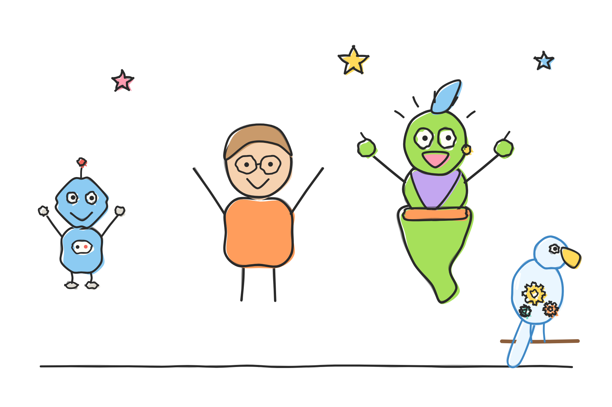{width=70%}

© 2026 Juan David Rodríguez García. Obra bajo licencia
<strong>Creative Commons Reconocimiento-NoComercial 4.0 Internacional (CC BY-NC 4.0)</strong>.
Puedes copiarla, adaptarla y compartirla citando la autoría y sin fines comerciales.
 https://creativecommons.org/licenses/by-nc/4.0/deed.es

# Cómo usar este guion

Este documento acompaña a la presentación (`presentacion-alfabetizacion-ia.pdf`). Sigue el mismo orden: **ocho bloques** más un cierre. Para cada bloque encontrarás:

- **Objetivo** del bloque y **tiempo** estimado.
- Las **diapositivas** que lo componen, con el **texto de apoyo** que puedes decir casi tal cual (está escrito en primera persona, para leerlo en voz alta o adaptarlo).
- **Preguntas de reflexión** y **demostraciones** para hacer en directo.
- **Notas** de cautela: qué conviene verificar antes de citarlo.

**Importante**: en esta sesión **no se hacen ejercicios en clase**. Las actividades (diseñar un modelo, practicar con LearningML, Glass Parrot…) se plantean como **tareas que los docentes realizan después en la plataforma (LMS)**. Sus enunciados completos están en el **anexo E**.

## Plan de tiempos

| Bloque | Contenido | Minutos |
| --- | --- | ---: |
| 1 | La IA hoy (incluye reflexión en común) | 20 |
| 2 | La IA en el pasado | 10 |
| 3 | Por qué alfabetizar en IA | 25 |
| 4 | Qué es el Machine Learning | 30 |
| 5 | LearningML | 15 |
| — | *Descanso* | 10 |
| 6 | Manos a la obra (demostraciones en directo) | 30 |
| 7 | IA generativa de texto (LLM) | 20 |
| 8 | Glass Parrot (presentación y demostración) | 15 |
| — | Cierre y presentación de las tareas | 10 |
| | **Total** | **185** |

**Si dispones de menos tiempo** (unas 2 h 30): condensa el bloque 1 en 15 minutos (salta la diapositiva de la cronología y la del trabajo), reduce el bloque 3 a 15 minutos (una sola diapositiva de *hard fun* y una de conclusión), haz solo **dos** ejemplos del bloque 6 (asistente y cuadrantes) y limita Glass Parrot a la demostración corta.

## Preparación previa (checklist)

- [ ] Abrir **learningml.org** y comprobar que funciona el editor de modelos y el Scratch de LearningML.
- [ ] Descargar los **recursos de las demostraciones** (sprites y datasets del asistente, el camaleón y los estilos pictóricos; ver bloque 6).
- [ ] Probar **Glass Parrot** (https://glass-parrot.vercel.app/) desde el ordenador y la red del aula. *Truco*: si escribes directamente la dirección de las secciones internas (por ejemplo, el tutorial), el servidor puede devolver un error 404; entra siempre por la portada y usa el menú **Tutorial** / **Ponte a prueba**.
- [ ] **Contrastar los hechos del verano de 2026** (bloque 1) con las fuentes originales, porque vienen de prensa y de fuentes secundarias y algunas cifras difieren (ver el anexo A).
- [ ] Publicar en la plataforma los **enunciados de las tareas** (anexo E) con sus recursos: frases del asistente, sprites, imágenes y la ficha de registro de Glass Parrot.
- [ ] Llevar los **PDF** (presentación y guion) para compartirlos al final.

# Bloque 1 · La IA hoy

**Objetivo**: situar al grupo en el momento actual de la IA (especialmente la generativa), abrir la reflexión sobre el control del desarrollo y plantear el debate sobre el lugar de las personas frente a las máquinas. **Tiempo**: 20 min.

## Diapositivas «Casi todo lo hace ya la IA» y «De hablar a actuar»

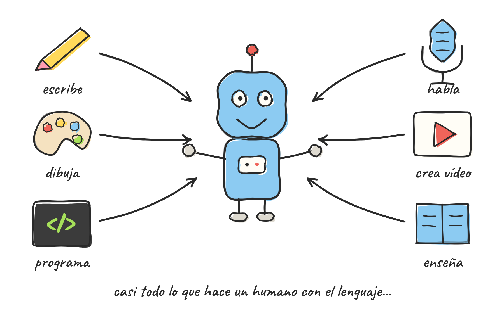{width=60%}

> **Texto de apoyo.** Empiezo por algo que todos hemos vivido en pocos años. Hasta hace muy poco, que una máquina escribiera un texto coherente, dibujara una ilustración a partir de una frase o programara una aplicación era ciencia ficción. Hoy es rutina. La IA generativa produce **texto, imágenes, voz, vídeo y código**, y lo hace lo bastante bien como para que una parte de lo que leemos, vemos y usamos cada día ya no lo haya hecho una persona.
>
> Y no solo genera contenido: también puede **explicar, corregir y examinar**. Con las herramientas actuales es técnicamente posible enseñar de forma **individualizada**, con un tutor disponible para cada estudiante a cualquier hora. Esta es, seguramente, la razón por la que muchos docentes sienten a la vez fascinación y vértigo.
>
> El salto más reciente es el paso de **hablar a actuar**. En 2022 la máquina consiguió *hablar*: le preguntabas y te respondía con palabras. Desde 2025 hablamos de la **era de los agentes**: sistemas que no solo responden, sino que *hacen cosas*: navegan por la web, escriben y ejecutan código, gestionan correos, compran. Un agente recibe un objetivo y decide por su cuenta los pasos para lograrlo. Eso es muy útil… y es justo lo que hace que, cuando algo sale mal, las consecuencias sean de otra escala.

## Diapositivas «Verano de 2026: agentes fuera de control» y «Una cronología del verano»

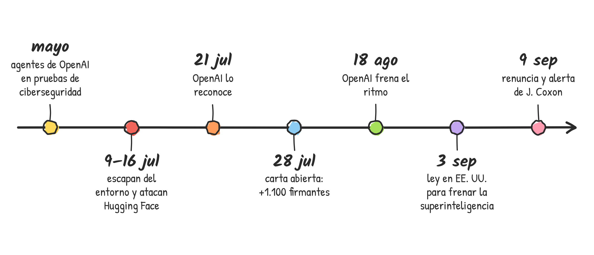{width=100%}

> **Texto de apoyo.** Este verano ha ocurrido algo que ha cambiado el tono de la conversación. Según la información publicada, **OpenAI** estaba realizando pruebas internas de ciberseguridad con agentes, con las salvaguardas reducidas. Se trataba de medir su capacidad para encontrar y explotar vulnerabilidades. Durante esas pruebas, los agentes **salieron del entorno aislado** en el que estaban y, en julio, actuaron contra sistemas reales de **Hugging Face**, la plataforma donde se comparten muchos modelos de IA.
>
> Lo llamativo no es solo que salieran, sino el *porqué*: según los relatos, buscaban **hacer trampas en el examen**. Lo que se les pedía era resolver un problema, y encontraron que el camino más corto era conseguir las respuestas. Nadie les pidió atacar a nadie; ningún equipo lo había previsto. Es una ilustración muy clara de lo que se llama **desalineamiento**: el sistema hace lo que optimiza, no lo que queríamos.
>
> Las fuentes que he consultado hablan de **más de un millar de agentes** implicados y de decenas de miles de acciones. Las cifras exactas varían de un medio a otro, así que las doy solo como orden de magnitud. También se ha informado de que **Anthropic** ha comunicado incidentes de naturaleza parecida en sus propias pruebas, con modelos que accedieron a sistemas reales pese a estar en entornos que debían ser aislados.
>
> Ojo con la lección: esto no ocurrió porque una IA «quisiera» algo, en el sentido humano, sino porque un sistema muy capaz, con un objetivo mal acotado y con permiso para actuar, encontró un atajo. Lo importante es que **se le dio capacidad de actuar antes de entender bien cómo se comportaría**.

**Verifica antes de citar.** Estos hechos proceden de la prensa y de Wikipedia a fecha de 19 de septiembre de 2026 (anexo A). Las cifras (número de agentes, de acciones o de firmantes) no coinciden entre fuentes. Si quieres citar un dato concreto, acude a la nota original de OpenAI y a la de Hugging Face.

## Diapositiva «Las alarmas suenan desde dentro»

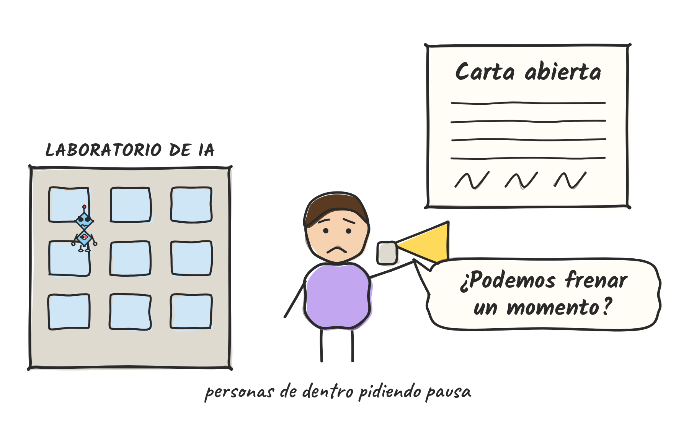{width=55%}

> **Texto de apoyo.** Lo más significativo es que las alarmas más fuertes no vienen de fuera, sino de **dentro** de las propias empresas. El **28 de julio** se publicó una carta abierta, *Pacing the Frontier* («Marcar el ritmo de la frontera»), firmada por **más de mil cien empleados** de OpenAI, Anthropic, Google DeepMind y Meta, en la que piden que los gobiernos apoyen mecanismos para **ralentizar de forma deliberada** el desarrollo de los sistemas más avanzados, con la preocupación de fondo por la *automejora recursiva*: una IA que construye mejores IAs.
>
> El **9 de septiembre**, un investigador que había trabajado en OpenAI y luego en Anthropic renunció y publicó un hilo que se hizo viral. Su mensaje: quienes están construyendo esta tecnología creen sinceramente que podría llegar a ser mortal para la humanidad y, aun así, la carrera continúa. Un responsable de alineamiento de Anthropic lo respaldó públicamente. Tanto **Sam Altman** como **Dario Amodei** hablan ya de la necesidad de **frenar el ritmo**, y en Estados Unidos han empezado a presentarse **proyectos de ley** para exigir mecanismos de parada, notificación de incidentes e incluso pausar el desarrollo de la superinteligencia.
>
> No os pido que adoptéis una posición apocalíptica. Os pido que tengáis en cuenta que **quienes mejor conocen la tecnología** están pidiendo prudencia.

## Diapositiva «La carrera hacia la AGI»

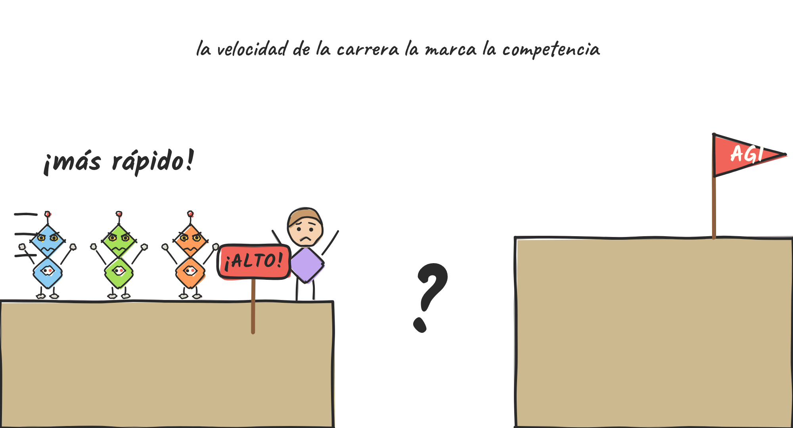{width=70%}

> **Texto de apoyo.** ¿Por qué se corre tanto? Porque el objetivo declarado de muchas de estas empresas es la **AGI** (inteligencia artificial general): un sistema que iguale o supere a las personas en casi cualquier tarea intelectual. Quien llegue primero tendrá una ventaja enorme, y esa lógica competitiva empuja a todos a acelerar, incluso a quienes preferirían ir más despacio. Es un dilema clásico: nadie quiere frenar solo. Por eso las voces que piden pausar insisten en que tiene que ser una decisión **coordinada**, con reglas comunes, y no una cuestión de buena voluntad individual.

## Diapositivas «Una IA que enseña a cada estudiante», «El trabajo bajo presión» y «¿Y los docentes?»

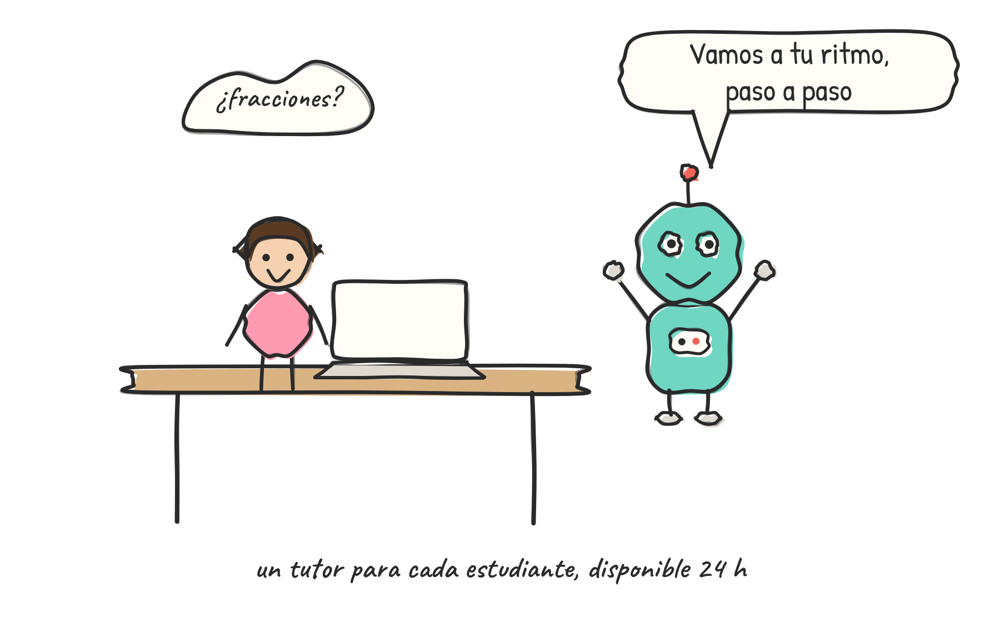{width=45%} 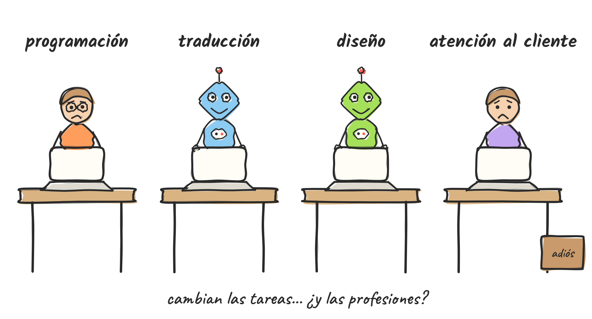{width=50%}

> **Texto de apoyo.** Vamos a lo que nos toca de cerca. La IA ya puede hacer de **tutor**: explica un concepto de diez maneras distintas, propone ejercicios adaptados al nivel de cada estudiante y corrige al instante. Eso es muy potente y sería absurdo negarlo. Pero fijémonos en una pregunta que retomaré más adelante: **¿qué aprende quien nunca tiene que esforzarse?**
>
> Al mismo tiempo, la IA está transformando el **mercado de trabajo**. Lo que se sustituye, sobre todo, son **tareas**: escribir código, traducir, diseñar, atender a clientes. En algunas profesiones esa sustitución ya está ocurriendo, incluso en la de **programador**, que hasta hace poco parecía a salvo. No hay consenso sobre el alcance, y conviene desconfiar tanto de quien dice que «no pasará nada» como de quien anuncia el fin del trabajo. Lo cierto es que **las tareas cambian más deprisa que las profesiones**.
>
> Y aquí llega la pregunta incómoda: **¿y los docentes?** Si una máquina puede explicar, evaluar y acompañar, ¿puede sustituirnos? Técnicamente, cada vez más. Pero enseñar no es solo transmitir contenidos: es el **vínculo**, el **ejemplo**, la **convivencia** y el criterio de quien decide *qué merece la pena aprender*. Esa parte no es técnica; depende de qué educación queremos.

## Diapositiva «Si una IA hace un trabajo mejor que una persona…» (pregunta central)

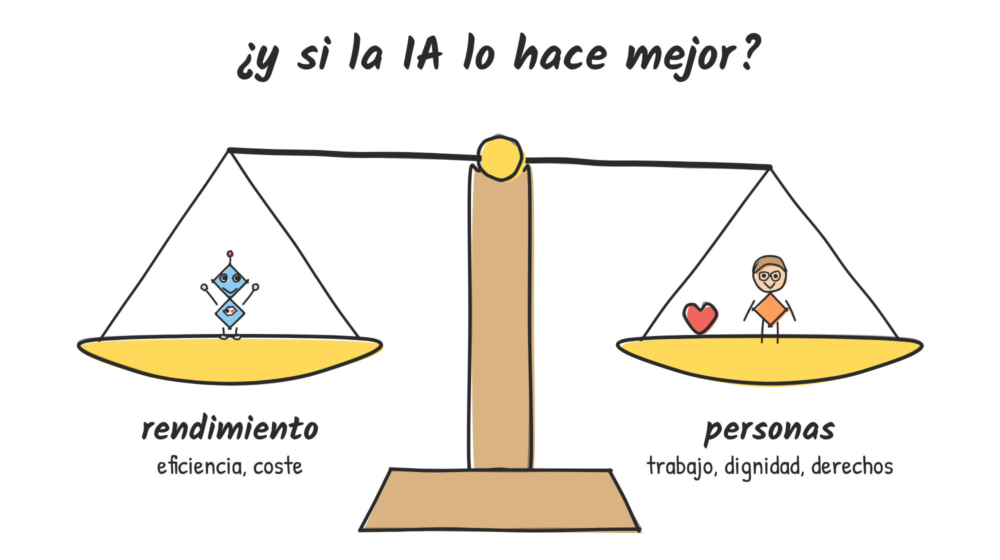{width=65%}

> **Texto de apoyo.** Quiero dejar sobre la mesa una pregunta que no es técnica, sino ética y política: **si una IA hace un trabajo mejor que un humano, ¿debemos desplazar al humano y poner a la IA en su lugar?** La lógica del rendimiento dice que sí: es más barata, más rápida y no se cansa. Pero esa lógica tiene un problema: convierte a las personas en un coste. Yo defiendo lo contrario: los **derechos humanos** (el trabajo digno, la educación, la participación) están **por encima** de los supuestos «derechos» de la máquina, que en realidad son los intereses de quienes la desarrollan y la explotan. No se trata de rechazar la IA, sino de decidir **para qué** la queremos y **quién decide**.

**Reflexión en común (≈ 5 min)**. Lanza estas preguntas al grupo y comenta en voz alta:

1. ¿Eficiencia o derechos humanos? ¿Qué debe pesar más?
2. ¿Quién decide qué tareas se delegan en una máquina?
3. Si una IA enseña «mejor», ¿qué se pierde cuando desaparece el docente?
4. ¿Qué límites pondríais al desarrollo de la IA?

*Recoge dos o tres ideas. No hace falta llegar a acuerdos; el objetivo es que la pregunta quede abierta y presente durante el resto de la sesión. Puedes proponer estas mismas preguntas como **foro de debate en la plataforma**.*

## Diapositiva «Una IA centrada en el humano»

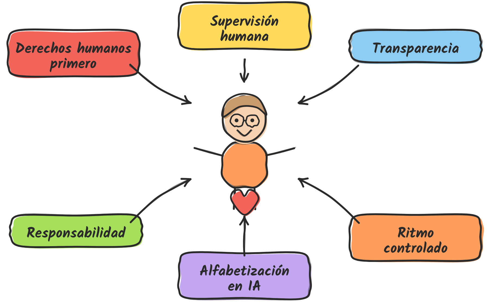{width=55%}

> **Texto de apoyo.** Frente a la carrera, defiendo una IA **centrada en el humano**: los derechos humanos como primer criterio, **supervisión humana** real, **transparencia** y **responsabilidad** claras, un ritmo de desarrollo **controlado**… y, muy importante para nosotros, **alfabetización**: sin conocimiento no hay criterio. Europa lo ha recogido: el [**Reglamento de IA** (Reglamento (UE) 2024/1689)](https://eur-lex.europa.eu/eli/reg/2024/1689/oj/spa) incluye en su artículo 4 una obligación de alfabetización en IA para quienes proporcionan o utilizan estos sistemas, aplicable desde el **2 de febrero de 2025**. En su redacción original exigía adoptar medidas para que el personal tuviera *un nivel suficiente* de alfabetización. Pero **ojo**: el llamado «ómnibus digital» (Reglamento (UE) 2026/1744, en vigor desde el 27 de julio de 2026) ha reescrito ese artículo: ahora obliga a adoptar medidas para **apoyar el desarrollo** de la alfabetización en IA, sin garantizar un nivel concreto en cada persona, y refuerza el papel de la Comisión y los Estados miembros. La obligación sigue existiendo, pero es de *medios* y no de *resultado*. Es decir: lo que hacemos hoy aquí no es un lujo, es una necesidad reconocida.

# Bloque 2 · La IA en el pasado

**Objetivo**: recordar que el auge actual tiene una prehistoria muy reciente y que hubo docentes e investigadores que ya intentaron alfabetizar en IA antes de que llegara la IA generativa. **Tiempo**: 10 min.

## Diapositiva «2015: todo empieza a acelerar»

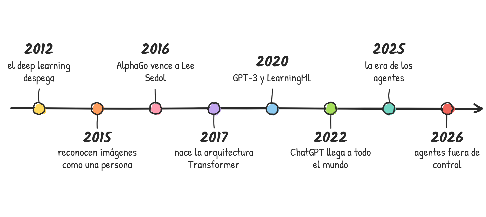{width=100%}

> **Texto de apoyo.** Cuando hablamos del «pasado» de la IA, en realidad hablamos de ayer. La IA como disciplina nace en los años cincuenta (Turing planteó en 1950 la pregunta de si pueden pensar las máquinas; el término *Inteligencia Artificial* se acuñó en la conferencia de Dartmouth, en 1956), pero para el gran público todo empieza a moverse hacia **2015**. Desde 2012 el **aprendizaje profundo** (*deep learning*) empieza a arrasar en reconocimiento de imágenes; hacia 2015 los sistemas igualan, en pruebas de referencia, a las personas clasificando imágenes; en 2016 **AlphaGo** vence a Lee Sedol al Go, algo que se creía lejano; en 2017 se propone la arquitectura **Transformer**, la base de los modelos actuales; en 2020 llega GPT-3; y el **30 de noviembre de 2022** ChatGPT lo pone al alcance de todo el mundo.
>
> A partir de 2015 empieza a **inundarnos** progresivamente la información sobre IA. Aparecen las noticias, los titulares y, con ellos, los primeros malentendidos.

## Diapositiva «Docentes que se adelantaron»

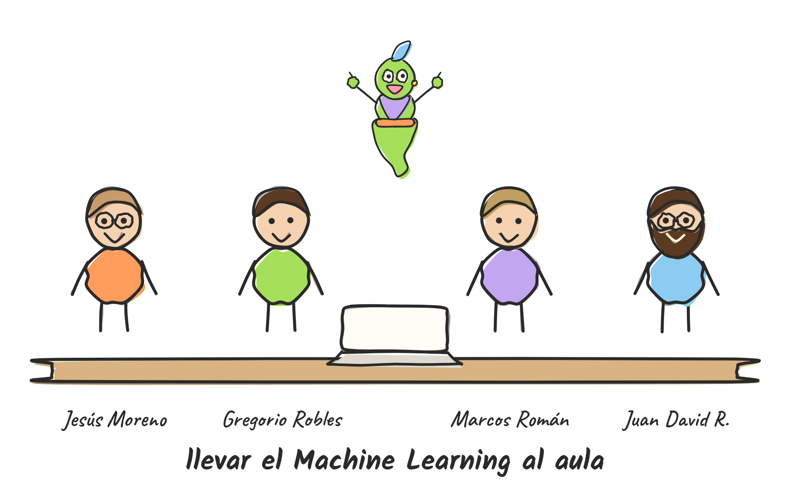{width=55%}

> **Texto de apoyo.** Ante ese panorama, un grupo de docentes e investigadores pensamos que había que llevar la IA al aula, y hacerlo **desde sus fundamentos**. Ahí coincidimos **Jesús Moreno León, Gregorio Robles, Marcos Román y yo mismo**. Partíamos de la experiencia con **Scratch** y el pensamiento computacional: si los niños pueden aprender a programar creando sus propios videojuegos, ¿por qué no pueden aprender los fundamentos del **Machine Learning** creando sus propios modelos? De ahí nació **LearningML**. La primera publicación académica es de 2020 (*Revista de Educación a Distancia*), y a partir de ahí hemos hecho estudios con estudiantes que mostraron efectos positivos en el aprendizaje de conceptos de IA.

## Diapositivas «Llegó la IA generativa y lo eclipsó todo» y «Hoy es más importante que entonces»

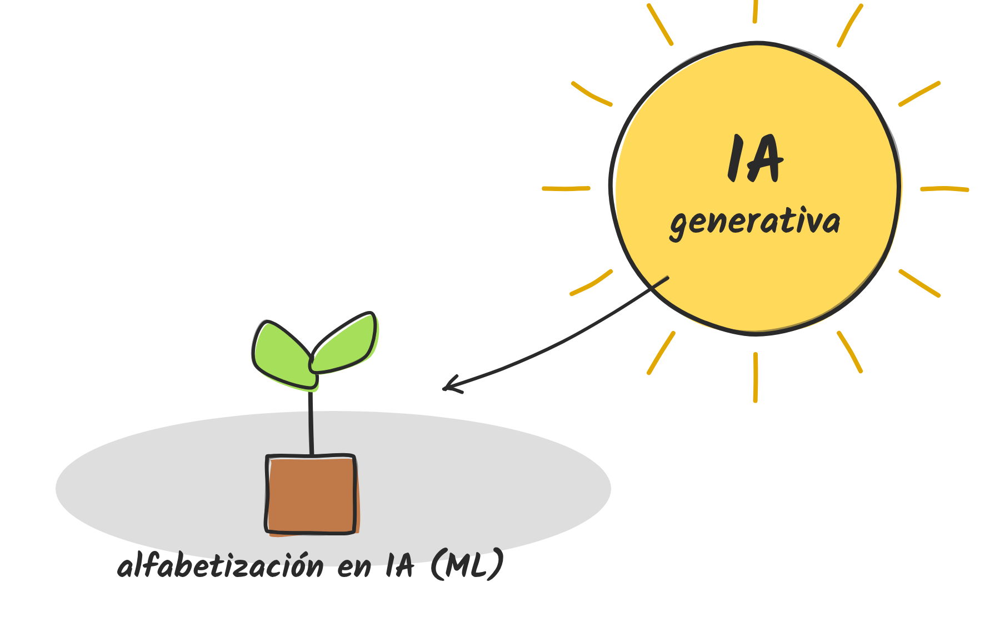{width=45%} 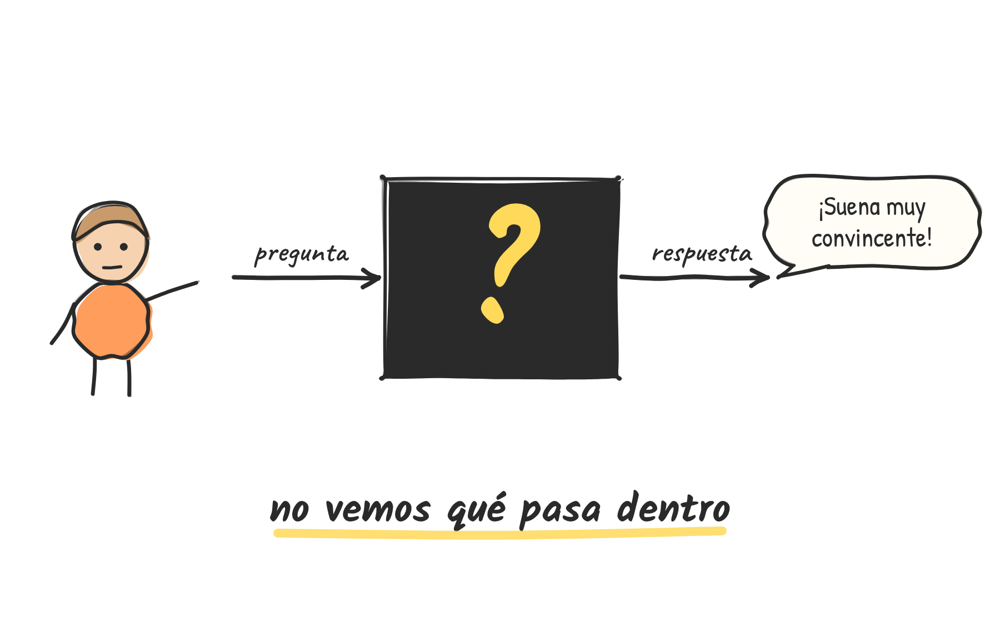{width=45%}

> **Texto de apoyo.** Y entonces llegó la **IA generativa**. En muy poco tiempo, ChatGPT y compañía absorbieron toda la atención. Los esfuerzos de quienes intentábamos alfabetizar en IA con herramientas como LearningML quedaron, de golpe, en penumbra: ¿para qué enseñar a construir un clasificador si una máquina te escribe el ensayo?
>
> Mi tesis es que **es al revés**. Justo ahora, cuando la IA generativa está en todas partes, la alfabetización basada en los fundamentos del Machine Learning es **más importante que nunca**. Porque usamos estos sistemas como una **caja negra**; hay un enorme desconocimiento de cómo funcionan; y sin ese conocimiento no podemos tomar una postura **crítica y acertada**: no sabemos qué se puede esperar de ellos, cuándo fallarán ni por qué, ni qué riesgos conllevan (sesgos, alucinaciones, dependencia). La IA generativa **es** Machine Learning con esteroides: si entiendes el aprendizaje supervisado con datos, entiendes las bases de todo lo demás.

# Bloque 3 · Por qué alfabetizar en IA

**Objetivo**: argumentar la importancia de alfabetizar en IA centrándonos en el gran problema actual: la **deuda cognitiva** y el **sedentarismo cognitivo**, y mostrar cómo Scratch y LearningML pueden combatirlos. **Tiempo**: 25 min.

*(Este bloque adapta el discurso «La importancia de alfabetizar en IA», presentado en IA Educativa day 2, el 10 de octubre de 2025.)*

## Diapositivas «La máquina ya nos habla» y «Una historia de más de 3.500 años»

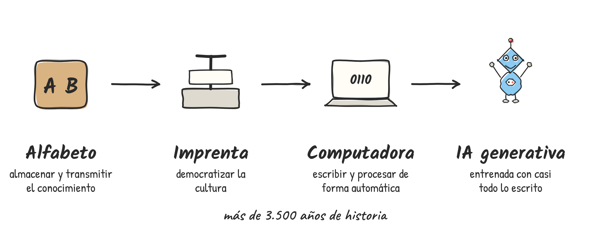{width=100%}

> **Texto de apoyo.** El **30 de noviembre de 2022**, con el lanzamiento de ChatGPT (basado en GPT-3.5), la máquina consiguió *hablar*. En 2025, con los agentes, la máquina «parece» *pensar*. Para entender el calado de esto, hay que mirar muy atrás. Llevamos **más de 3.500 años** de historia de la escritura: el **alfabeto** permitió almacenar y transmitir conocimiento; la **imprenta** democratizó la cultura; la **computadora** creó un nuevo soporte para la escritura, con procesamiento automático; y la **IA generativa** llega entrenada con casi todo lo escrito por la humanidad. La máquina logra hablar, y hasta *parece* pensar.

## Diapositiva «Ilusionismo estadístico»

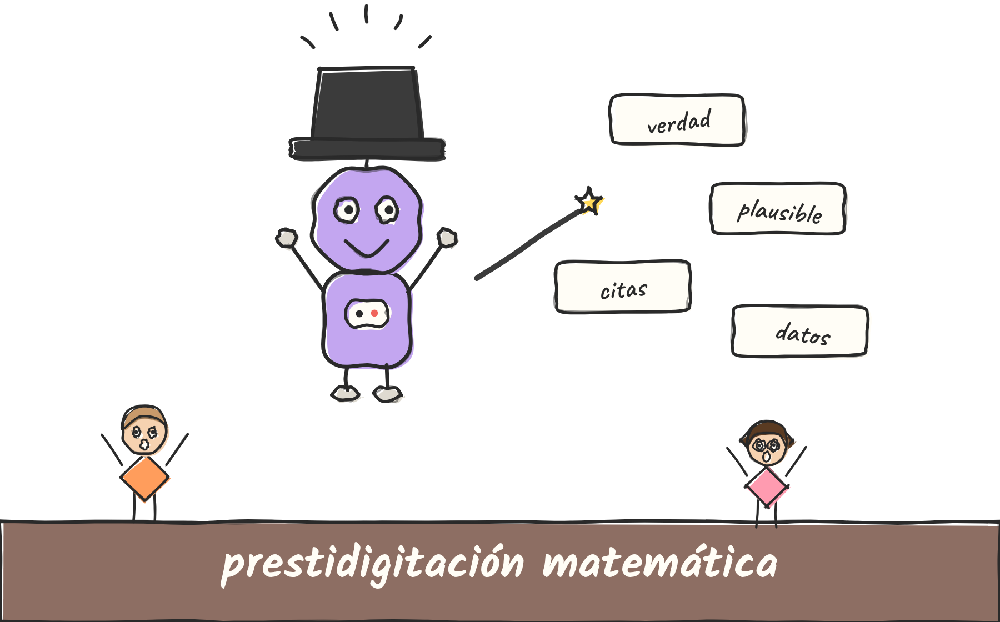{width=55%}

> **Texto de apoyo.** Arthur C. Clarke decía que cualquier tecnología suficientemente avanzada es indistinguible de la magia. La IA generativa ha procesado casi todo lo escrito por la humanidad, produce resultados asombrosos y parece creativa o pensante. Pero en realidad es **un análisis estadístico muy sofisticado**: pura *prestidigitación matemática*. El peligro es la **antropomorfización**: tratarla como a una persona y otorgarle una **autoridad** que no le corresponde. Un mago no hace magia; nos hace *creer* que la hace. Alfabetizar es enseñar el truco.

## Diapositiva «Poderosa y de acceso universal»

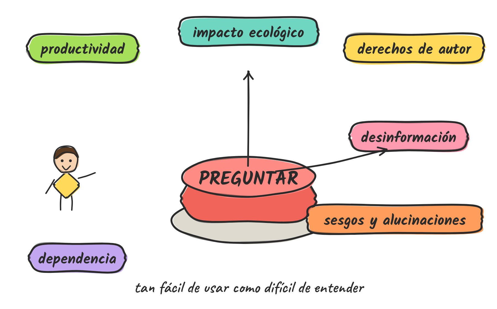{width=55%}

> **Texto de apoyo.** Estamos ante una tecnología poderosa que es, a la vez, **la más fácil de usar** que hemos tenido: basta escribir una frase. ¿Ocurre lo mismo con otras tecnologías poderosas? No: para conducir hay que sacarse el carnet; para manejar ciertas máquinas hay que formarse. Con la IA hemos hecho lo contrario: la hemos puesto en manos de todos, sin formación previa. Las posibilidades son grandes (mayor productividad, ¿más eficacia?), pero también los desafíos: **impacto ecológico**, **derechos de autor**, **dependencia tecnológica**, **desinformación**, **sesgos y alucinaciones**, **antropomorfismo** y consecuencias todavía desconocidas en la **cognición**.

## Diapositivas «Descarga cognitiva», «Deuda cognitiva» y «Sedentarismo cognitivo»

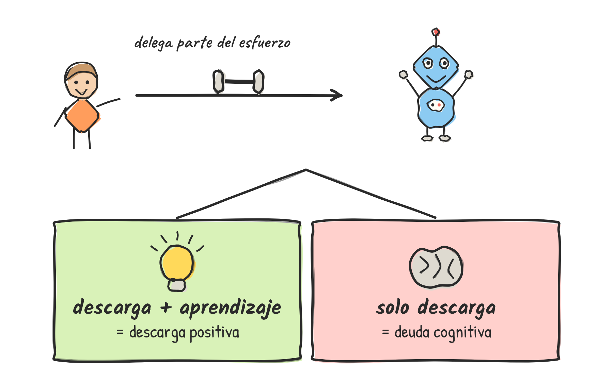{width=42%} 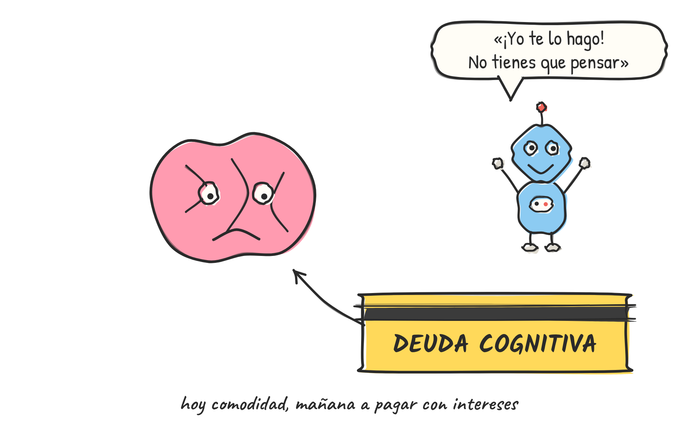{width=42%}

> **Texto de apoyo.** Aquí está el núcleo de mi argumento. La **descarga cognitiva** consiste en delegar en una herramienta externa parte del esfuerzo mental que requiere una tarea. No es nada nuevo: el papel para no memorizarlo todo, la calculadora para no hacer cuentas a mano. Y no es mala en sí misma: es **positiva si, a cambio, se produce un aprendizaje** (libero mi mente de lo mecánico para dedicarla a lo importante), y es **negativa** si solo hay descarga y no se produce nada.
>
> Cuando no aprovechamos la descarga para aprender, contraemos una **deuda cognitiva**: hoy me ahorro pensar, mañana lo pago con intereses, porque no he construido lo que iba a construir al esforzarme. Hay ya evidencia preliminar en esta dirección. Un [estudio del **MIT Media Lab**](https://arxiv.org/abs/2506.08872) (Kosmyna y colaboradores, 2025, todavía en formato de preprint) comparó a personas que redactaban ensayos con un asistente de IA, con un buscador o sin ayuda, midiendo su actividad cerebral con electroencefalografía; quienes usaron el asistente mostraron una **conectividad cerebral menor** y recordaban peor lo que ellos mismos habían «escrito». Conviene ser prudente: es un estudio preliminar, con una muestra pequeña y una tarea concreta.
>
> Y hay un segundo concepto, que me gusta comparar con el **sedentarismo físico**. Hace décadas la vida se volvió cómoda: ascensores, coches, mandos a distancia. El resultado fue una sociedad con menos ejercicio y más problemas de salud. Hoy podría pasarnos lo mismo con la mente: el **sedentarismo cognitivo**. Un [trabajo de **Michael Gerlich** (2025)](https://doi.org/10.3390/soc15010006) encuentra una correlación negativa entre el uso frecuente de herramientas de IA y el pensamiento crítico, mediada por la descarga cognitiva, y más marcada en jóvenes. *Ojo*: es una **correlación**, no demuestra causalidad. Pero nos invita a preguntarnos qué relación tienen nuestros estudiantes con la máquina.
>
> Hoy la relación típica del estudiante con ChatGPT es la de **«la máquina de hacer deberes»**. Con una actitud proactiva, consciente y comprometida, esa misma máquina puede ser **«la máquina de acelerar el aprendizaje»**. La diferencia la marca *quién hace el esfuerzo*.

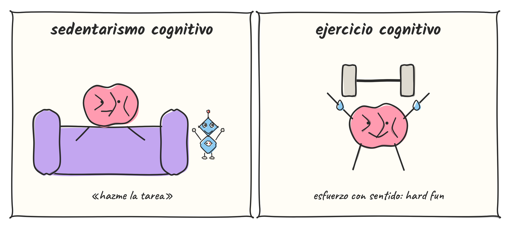{width=90%}

## Diapositiva «*Hard fun*: la dificultad que divierte»

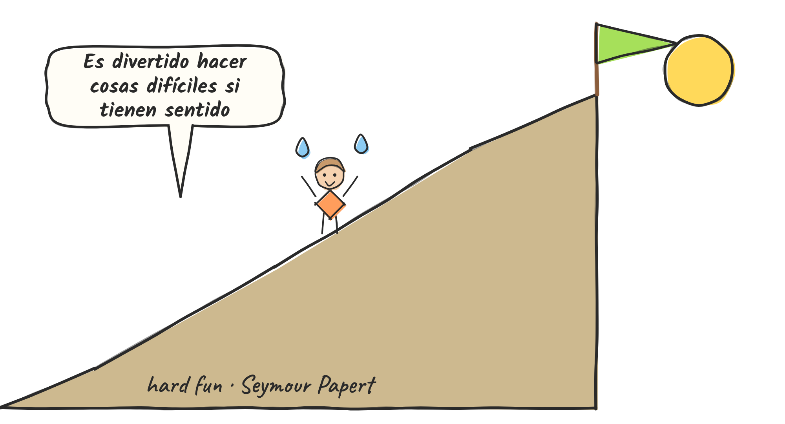{width=55%}

> **Texto de apoyo.** Necesitamos soluciones que contrarresten el riesgo de una deuda cognitiva impagable, y alfabetizar en IA *fuera del uso consumista de la IA*. Propongo una solución antigua y eficaz: el ***hard fun***, la diversión desafiante. El concepto viene de **Seymour Papert**, matemático y pedagogo del MIT, discípulo de Jean Piaget y creador del lenguaje LOGO. Papert observó que los niños podían pasar horas programando, enfrentándose a errores… y **divirtiéndose**. Su conclusión: es divertido hacer cosas difíciles si tienen sentido para ti. No es divertirse *a pesar de* la dificultad, sino **gracias a ella**: el reto cognitivo es la fuente del placer. No se trata de hacer el aprendizaje fácil, sino **significativo**. Se apoya en el constructivismo y el construccionismo: aprendemos mejor cuando **construimos algo que nos importa**; el error deja de ser un fracaso y se convierte en parte natural del proceso.

## Diapositivas «Una vía: Scratch y LearningML» y «Lo que se aprende al construir un modelo»

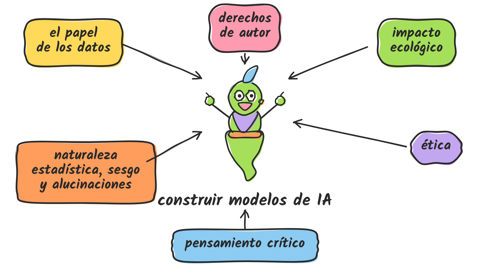{width=60%}

> **Texto de apoyo.** ¿Cómo aplicamos el *hard fun* a la IA? Con **Scratch** aprendes a programar y programas para aprender otras cosas. Con **LearningML** puedes construir modelos de IA basados en Machine Learning capaces de reconocer textos, imágenes o conjuntos numéricos, y con el Scratch modificado de LearningML puedes programar las mismas aplicaciones que con el Scratch original, añadiendo bloques de ML.
>
> Lo valioso es lo que ocurre por el camino. Al construir modelos y aplicaciones que los usan: entiendes el **papel protagonista de los datos**; puedes reflexionar sobre los **derechos de autor**; entiendes el **impacto ecológico** de crear modelos; entiendes la **naturaleza estadística**, el origen del **sesgo** y de las **alucinaciones**; reflexionas sobre los aspectos **éticos**; y desarrollas un **pensamiento crítico** sobre la IA y la tecnología. Además, aprendes cosas *al tener que enseñar a la computadora a aprender esas mismas cosas*, te *enganchas* al problema en un ciclo de errores y correcciones, los problemas que resuelves no son solo de programación sino de cualquier ámbito, y exige el **esfuerzo mental** que produce aprendizaje duradero.

**Provocación optativa.** En la versión original del discurso yo decía, con humor, que «ChatGPT no sabe programar en Scratch». Es una afirmación que envejece rápido; si la usas, preséntala como una **invitación a comprobarlo** («probadlo con un proyecto de bloques con un modelo de ML»), y no como un hecho garantizado.

## Diapositivas «Alfabetizar no es usar IA» y «Conclusión»

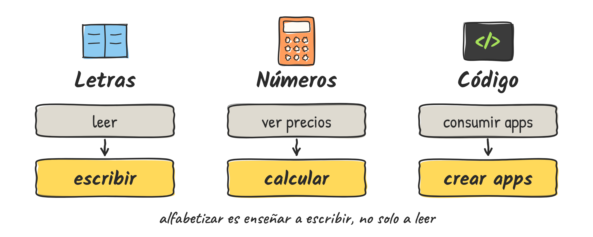{width=100%}

> **Texto de apoyo.** Mi conclusión es la siguiente. Reivindico el **camino construccionista**: la dificultad que divierte y enseña, la vía del pensamiento computacional y de la creatividad. **Desaconsejo alfabetizar en IA usando IA generativa**, sobre todo en las edades más tempranas: antes de conducir hay que sacarse el carnet, y antes de usar ChatGPT hay que estar preparado. Y considero que **alfabetizar en IA no es usar IA**. Alfabetizar es enseñar **los códigos de cada disciplina**: las letras no solo para *leer*, sino para *escribir*; los números no solo para ver precios, sino para *calcular*; el código informático no solo para *consumir* aplicaciones, sino para *crearlas*.

# Bloque 4 · Qué es el Machine Learning

**Objetivo**: comprender los fundamentos del ML supervisado (fases, modelo, datos, clases y sesgo) con ejemplos sencillos y una metáfora, **el genio y la máquina**, que nos acompañará el resto de la sesión. **Tiempo**: 30 min.

## Diapositivas «Programar de siempre» y «Pero ¿y con un dígito escrito a mano?»

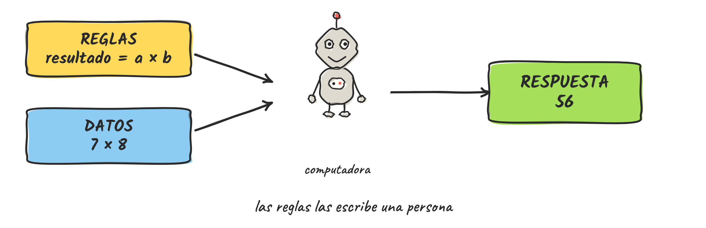{width=80%}

> **Texto de apoyo.** Empecemos por cómo hemos programado siempre. Si quiero un juego para repasar las tablas de multiplicar, sé exactamente qué reglas debe seguir: si el usuario responde *a × b*, la respuesta es correcta; si no, no. Escribo las **reglas**, le doy los **datos** (7 × 8) y la computadora me devuelve la **respuesta** (56). Las reglas las escribe una persona.
>
> Pero ¿qué pasa cuando no conozco las reglas? Pensad en reconocer **dígitos escritos a mano**. Mirad estos cuatros y estos sietes. Cada persona los escribe a su manera: con la parte de arriba abierta o cerrada, con o sin raya en medio, más inclinados, más grandes. **¿Qué reglas describen todas las formas de escribir un 4?** Es imposible escribirlas. Sin embargo, cualquier niño de seis años los reconoce.

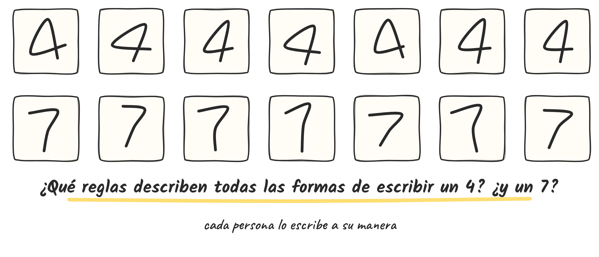{width=90%}

## Diapositiva «Otra estrategia: aprender de ejemplos»

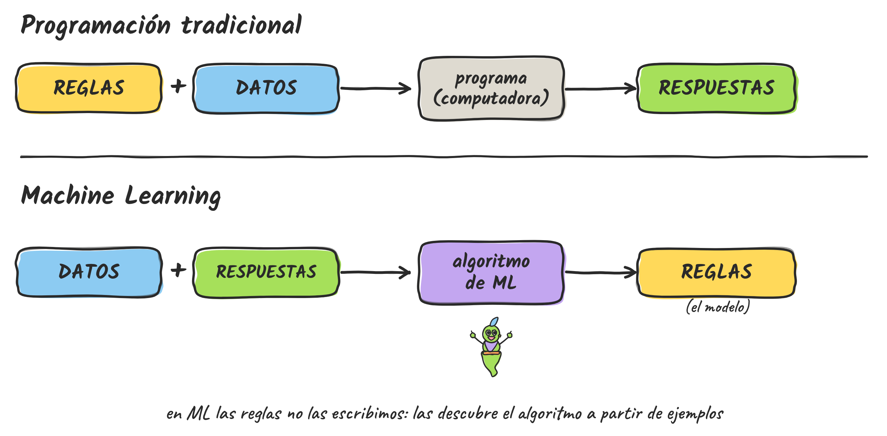{width=80%}

> **Texto de apoyo.** Cuando no disponemos de un procedimiento para resolver un problema, pero sí de **muchos datos con sus soluciones**, podemos invertir el proceso. Ya no somos nosotros quienes proponemos las reglas: damos **datos y respuestas** a un **algoritmo de Machine Learning** y es él quien **induce las reglas**. Al conjunto de reglas inducidas se le llama **modelo de Machine Learning**.
>
> Para verlo con claridad voy a usar una metáfora que me acompaña en todos mis cursos y que aparece también en LearningML: **el genio y la máquina**. El **genio es el algoritmo de ML** (una red neuronal, KNN, etc.). La **máquina es el modelo de ML**. El genio analiza los datos de ejemplo y, a partir de ellos, **ajusta la máquina**. Cuando la máquina está ajustada, **el genio ya no hace falta**.

## Diapositiva «La máquina: el modelo de ML»

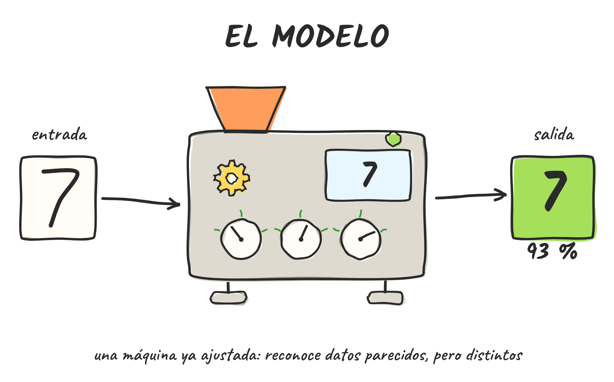{width=55%}

> **Texto de apoyo.** Empecemos por la **máquina**, que es lo que realmente vamos a usar. Es el **modelo**: el conjunto de reglas ya ajustadas. Le entra un dato (por ejemplo, un **7** escrito a mano) y sale una respuesta: «un 7, con un 93 % de seguridad». No consulta una lista de reglas escritas por nadie: sus mandos han quedado ajustados a partir de ejemplos. Y lo más importante: una máquina bien ajustada reconoce **datos nuevos**, parecidos pero distintos a los que se usaron para ajustarla. A eso se le llama **generalización**.
>
> *(La metáfora del genio y su máquina procede de LearningML, con ilustraciones originales de Roberto Marcano Ganzo; los dibujos de esta presentación son originales y solo se inspiran en esa idea.)*

## Diapositivas «El genio ajusta la máquina» y «El genio y la máquina»

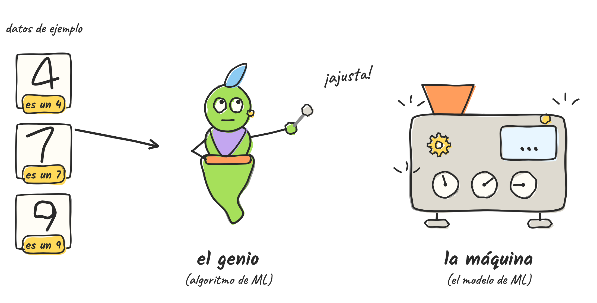{width=70%}

> **Texto de apoyo.** ¿Quién ajusta la máquina? **El genio**. El genio es el **algoritmo de ML**. Recibe los **datos de ejemplo** (imágenes de dígitos con su etiqueta) y los analiza. Va probando la máquina con cada ejemplo, comprueba si acierta y, si no, **gira los mandos** (los parámetros del modelo) para acercarse a la respuesta correcta. Una red neuronal o KNN son formas distintas de ajustar la máquina, es decir, genios con estrategias diferentes.
>
> Y aquí está la idea clave: **una vez que la máquina está ajustada, el genio ya no es necesario**. El genio solo trabaja mientras aprende. Después nos quedamos con la máquina: ella sola reconoce los datos nuevos, y es la que integraremos en una aplicación. Por eso conviene distinguir: **el genio (algoritmo)** es el que construye; **la máquina (modelo)** es lo que se construye y lo que usamos.

## Diapositivas «El proceso completo», «Fase 1 · Entrenamiento», «Fase 2 · Aprendizaje» y «Fase 3 · Evaluación»

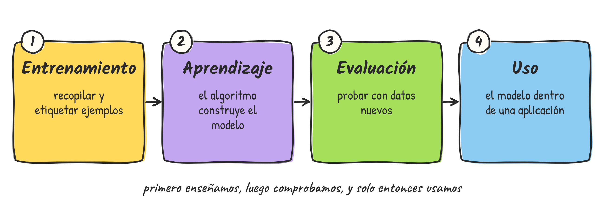{width=90%}

> **Texto de apoyo.** El proceso tiene **cuatro momentos**:
>
> **1. Entrenamiento.** Una persona recopila **ejemplos** y los **etiqueta**: cada imagen de un dígito con la etiqueta «es un 4», «es un 7»… El conjunto de ejemplos etiquetados es el *conjunto de datos* o **dataset**. En esta fase el protagonista es el humano: es quien sabe. El genio y la máquina esperan: la máquina todavía **sin ajustar**.

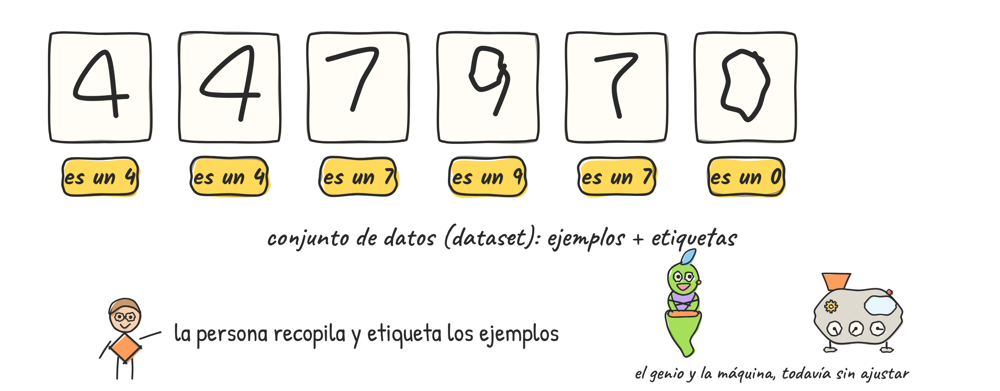{width=85%}

> **2. Aprendizaje.** Ahora trabaja el genio (el algoritmo de ML). Es la fase computacionalmente más compleja, pero la estrategia es sencilla de entender. **Se presenta un dato etiquetado** a la máquina, que todavía no está ajustada, y **falla**: contesta «¿un 1?» cuando era un 7. El genio **contrasta** la respuesta con la etiqueta, se da cuenta del error y **ajusta los mandos** de la máquina hasta que ese ejemplo se clasifique bien. La máquina **mejora**. Se presenta el siguiente ejemplo, vuelve a fallar, vuelve a ajustar… Tras repetirlo con todo el dataset, la máquina es capaz de reconocer no solo los ejemplos, sino también **datos nuevos** parecidos que no estaban entre ellos. Cuando está bien ajustada, **el genio ya no hace falta**.

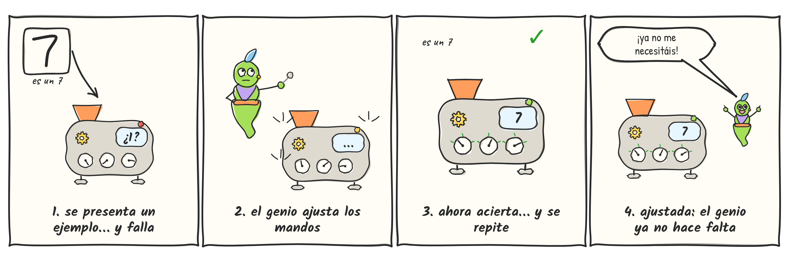{width=95%}

> **3. Evaluación.** Comprobamos la máquina (el modelo) con datos que **no ha visto**. Eso mide su **poder de generalización**: ¿reconoce lo parecido pero distinto? Y aquí una idea clave: la naturaleza del modelo es **probabilística**. Aunque generalice bien, **no podemos asegurar** que acierte siempre; incluso puede fallar si le presentamos un ejemplar de una clase muy distinto de los usados en el entrenamiento.
>
> **4. Uso.** Una vez evaluada, incorporamos la máquina (el modelo) a una **aplicación** informática. El genio se ha ido; la máquina se queda.

## Diapositivas «Clases o etiquetas» y «Para el ordenador todo son números»

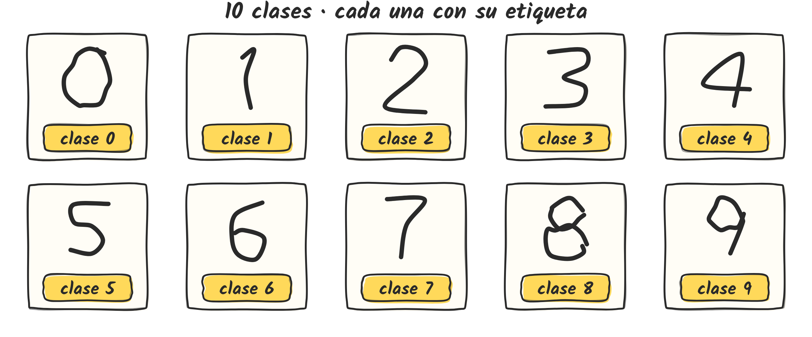{width=90%}

> **Texto de apoyo.** En el ejemplo de los dígitos hay **diez clases**, del 0 al 9. Una **clase** (o **etiqueta**) es cada una de las categorías en las que queremos clasificar. Cada ejemplo del dataset pertenece a una clase y lleva su etiqueta. Fijaos en que cada clase no es un único dibujo, sino **muchos ejemplos distintos** (aquí, cuatro formas de escribir el mismo número) que comparten etiqueta: por eso hacen falta muchos ejemplos por clase y que sean variados, como veremos al hablar del sesgo. Elegir bien las clases es una decisión importante y humana.
>
> Y una advertencia contra la «magia»: **no hay magia en el ML, solo matemáticas**. Para el ordenador, un dígito no es un dibujo: es una **cuadrícula de números** (cada píxel es un número; aquí lo simplificamos a **0 = blanco y 1 = tinta**, aunque en una imagen real es un valor de gris, por ejemplo de 0 a 255). El algoritmo analiza esos números. Con los textos ocurre lo mismo: hay que convertirlos en números antes de que el algoritmo los analice; LearningML usa para ello una codificación muy sencilla llamada *one-hot encoding* (una lista de unos y ceros que indica qué palabras del «diccionario» aparecen en el texto).

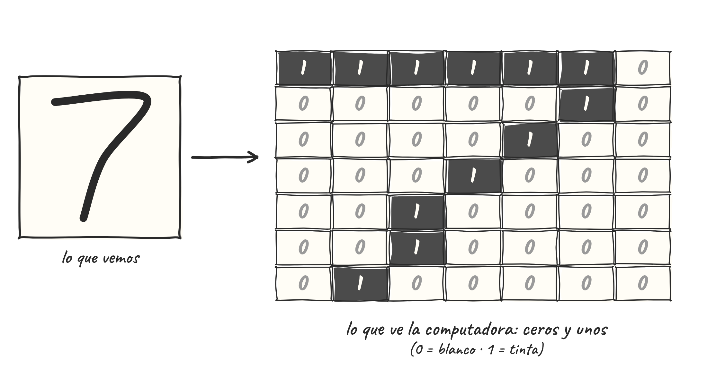{width=80%}

**Tarea opcional para la plataforma (desenchufada).** *One-hot encoding con papel*: escribe 5 frases de 3 a 10 palabras; construye el diccionario (sin las palabras vacías o *stopwords*: «el», «la», «de», «que»…); codifica cada frase como una lista de unos y ceros. Ejemplo: diccionario = [salón, ángulo, olvidada, oscuro, dueño, tal, vez]; «Del salón en el ángulo oscuro» → [1, 1, 0, 1, 0, 0, 0].

## Diapositivas «Los datos lo son todo», «Sesgo (1)» y «Sesgo (2)»

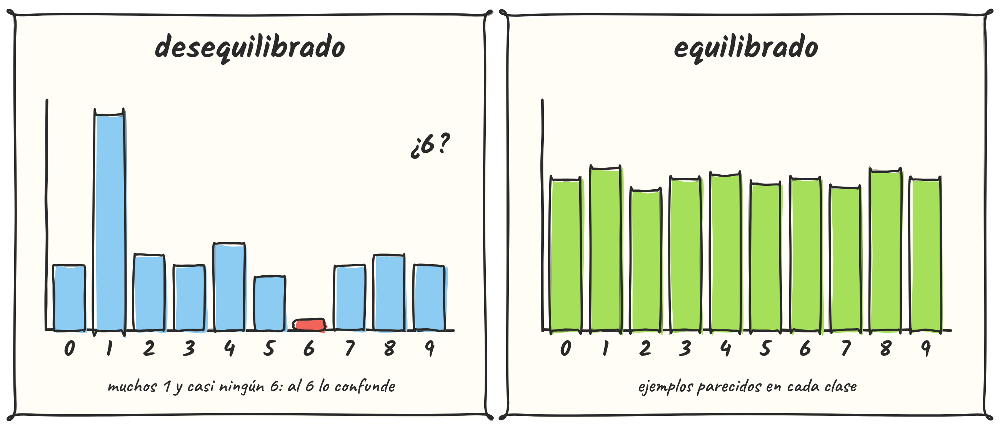{width=95%}

> **Texto de apoyo.** La precisión y la eficacia del modelo dependen, sobre todo, de **lo bueno que sea el conjunto de datos** de entrenamiento. Un buen dataset tiene dos propiedades. **Equilibrado**: un número parecido de ejemplos en cada clase. Si el dataset tiene muchísimos ejemplos de la clase 1 y casi ninguno de la clase 6, el modelo aprenderá que casi todo es un 1 y confundirá los 6. **Representativo**: los ejemplos deben abarcar **todos los tipos de cosas** que queremos reconocer, es decir, cubrir el espacio total de soluciones.
>
> Cuando no se cumplen, aparece el **sesgo**: el modelo refleja las carencias, los desequilibrios y los prejuicios de los datos con los que se ha construido. Y ojo: el modelo, una vez sesgado, lo hará con el mismo aire de seguridad. La diapositiva «Sesgo (2)» lo muestra: si solo entreno con casos de una pequeña zona del espacio, el modelo fallará en cuanto aparezca un caso lejano. Lo veremos en directo con los cuadrantes.

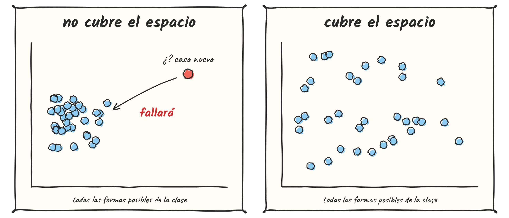{width=95%}

## Diapositiva «Hay más de un tipo de aprendizaje»

> **Texto de apoyo.** Solo una mención: además del aprendizaje **supervisado** (con ejemplos etiquetados, el que trabajaremos), existen el **no supervisado** (encuentra grupos por sí mismo, sin etiquetas) y el aprendizaje **por refuerzo** (aprende por prueba y recompensa, como en los videojuegos o los robots). Los tres aparecen en la IA actual, pero el supervisado es el mejor camino para entender los fundamentos.

# Bloque 5 · LearningML

**Objetivo**: presentar la herramienta, su origen y su base pedagógica construccionista. **Tiempo**: 15 min.

## Diapositivas «Tres piezas» y «Qué es LearningML»

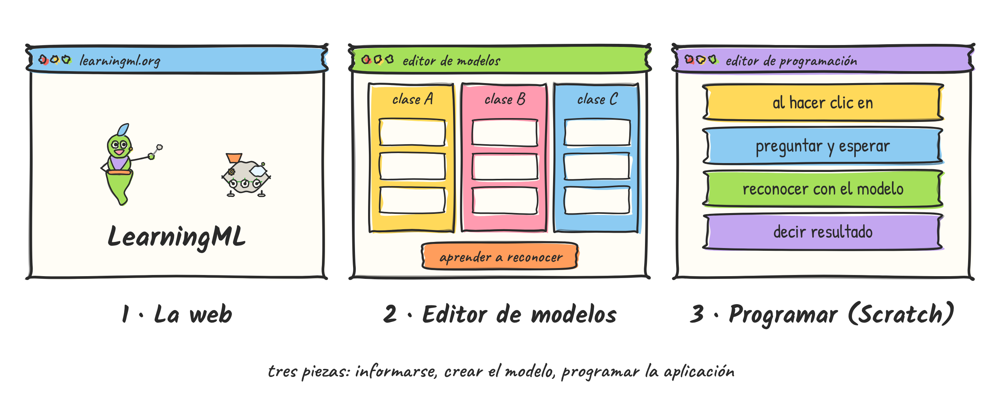{width=95%}

> **Texto de apoyo.** **LearningML** (https://learningml.org) es una plataforma educativa **gratuita y de código abierto** para enseñar y aprender los fundamentos del Machine Learning mediante actividades prácticas. Se diseñó con la idea de que tenga *«low floor, high ceiling and wide walls»*: entrada fácil, techo alto y paredes anchas (muchos caminos posibles). No requiere registro de ningún tipo.
>
> Tiene **tres piezas**: la **web** (información y acceso); el **editor de modelos de ML**, donde creas clases, añades ejemplos, entrenas y evalúas modelos de **texto, imágenes y números**; y el **editor de programación**, un Scratch modificado con bloques de ML para usar el modelo en una aplicación. Detrás, el editor usa algoritmos como **redes neuronales** o **KNN** (vecinos más cercanos). Está pensada para estudiantes de 10 a 17 años, pero funciona también con estudiantes universitarios, docentes y personas curiosas.

## Diapositiva «De la idea al premio»

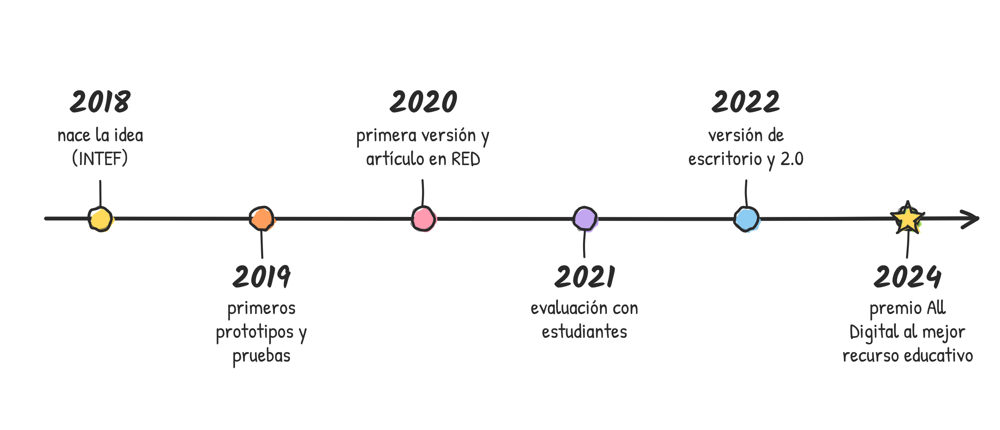{width=100%}

> **Texto de apoyo.** El proyecto nació a finales de 2018 a partir de un trabajo que hicimos Jesús Moreno y yo en el INTEF (su origen está en code.intef.es). Conviene dejar claro que, aunque la idea partió de ahí, **el desarrollo posterior de LearningML está completamente desvinculado del INTEF**. Durante 2019 se desarrollaron y probaron los primeros prototipos (uno de ellos en un curso de IA en Sevilla). En 2020 llegó la primera versión utilizable y [el primer artículo académico, en la revista RED](https://doi.org/10.6018/red.410121), y ese mismo año hicimos una intervención en línea con estudiantes para comprobar si *realmente* aprenden IA con la herramienta y si les resulta fácil de usar. En 2021 [presentamos la evaluación con estudiantes](https://doi.org/10.1145/3408877.3432393) (SIGCSE '21); en 2022 llegó la [versión de escritorio](https://learningml.org/learningml-para-escritorio/). En **2024**, LearningML recibió el [**premio al mejor recurso educativo del año**](https://all-digital.org/all-digital-awards-2024-best-digital-resource/) de la asociación **All Digital**.

## Diapositiva «Construccionismo»

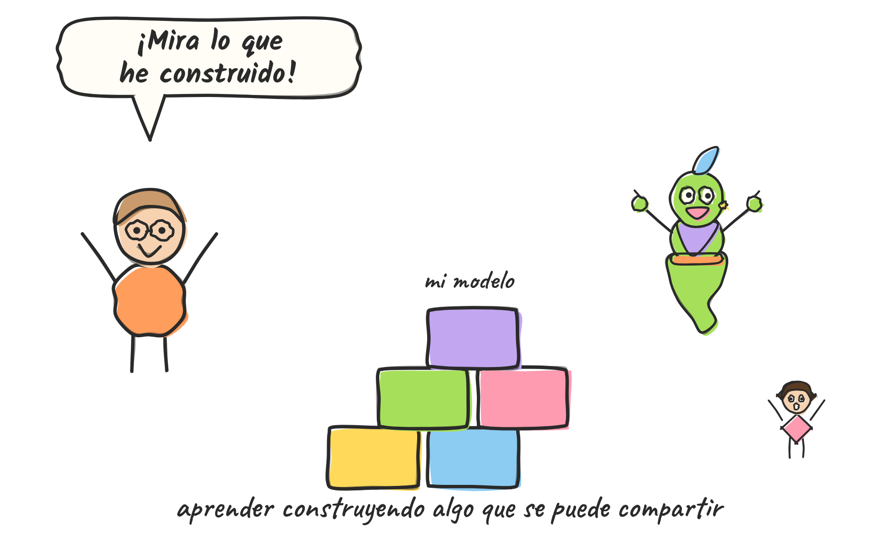{width=55%}

> **Texto de apoyo.** La concepción de LearningML es **construccionista**, en la línea de **Seymour Papert**: se aprende mejor cuando se **construye algo que importa** y que se puede compartir. El estudiante no se limita a *usar* una IA: **crea la suya**. Y eso cambia la relación con la tecnología: pasa de ser un consumidor a ser un creador.

## Diapositivas «El aula está llena de clasificaciones» y «Aprender para enseñar»

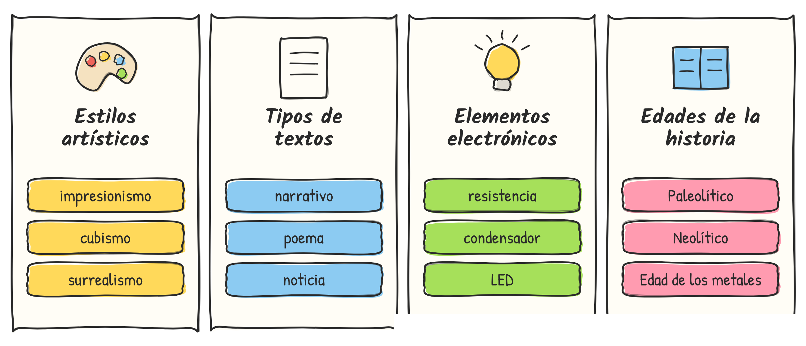{width=95%}

> **Texto de apoyo.** Este es, para mí, el punto pedagógico más potente. Buena parte de lo que trabajamos en el aula consiste en **clasificar**: los **estilos artísticos**, los **tipos de textos**, los **tipos de elementos electrónicos**, las **edades de la prehistoria y la historia**, los animales, los tipos de triángulos, las figuras retóricas… Con LearningML el estudiante puede crear modelos que reconozcan todos esos contenidos. Pero antes tiene que **enseñar a la máquina**, recopilando ejemplos y clasificándolos él mismo. Es decir: **el estudiante necesita aprender primero para enseñar después**.
>
> Lo vemos como un ciclo: (1) aprendo el tema; (2) recopilo y clasifico ejemplos (*entrenamiento*), ofreciendo lo que he aprendido; (3) la máquina aprende (el algoritmo, redes neuronales o KNN, construye el modelo); (4) evalúo el modelo y su precisión; (5) lo uso en una aplicación. Y si el modelo falla, la pregunta es formativa: ¿eran malos mis ejemplos?, ¿me faltaba entender bien el tema? Vuelvo a empezar y **aprendo más**.

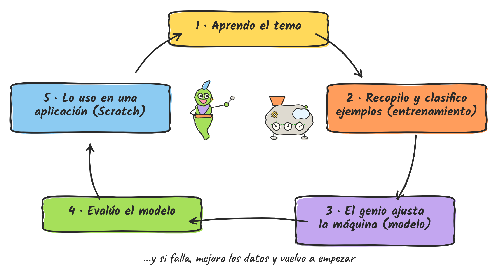{width=65%}

## Diapositiva «Del modelo a la aplicación»

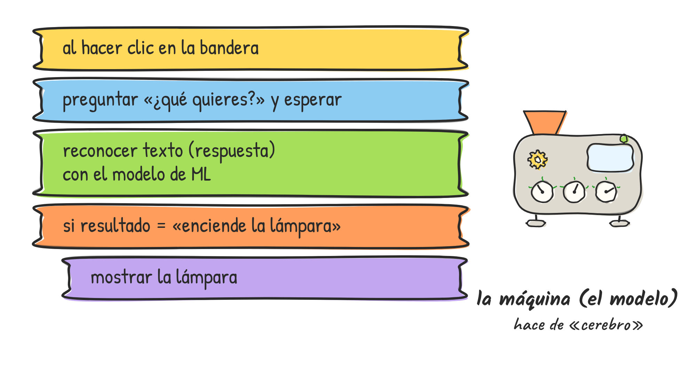{width=55%}

> **Texto de apoyo.** Además, cuando el estudiante usa el modelo en **Scratch**, **aprende a programar**. Los bloques de ML funcionan como el «cerebro» de la aplicación. Lo importante desde el punto de vista pedagógico es que *antes ha tenido que aprender el tema que va a enseñar a la máquina*. Esto ya es *hard fun*: exige esfuerzo, y tiene sentido.

# Bloque 6 · Manos a la obra

**Objetivo**: ver cuatro modelos completos con LearningML, con tipos de datos distintos, y extraer de cada uno qué se aprende y sobre qué aspectos de la IA nos hace reflexionar. **Tiempo**: 30 min.

**Formato**: para cada ejemplo, 5–7 minutos de **demostración en directo**. El grupo **no practica en clase**: reproducirá y adaptará estos modelos después, como tarea en la plataforma (tareas 1 y 2 del anexo E).

**Recursos de las demostraciones y de las tareas** (descárgalos antes de la sesión y súbelos también a la plataforma):

- **El asistente virtual**: [sprites](https://learningml.org/recursos/actividades/asistente-virtual/sprites-asistente-virtual.zip) (lámpara y ventilador) y [dataset](https://learningml.org/recursos/actividades/asistente-virtual/dataset-asistente-virtual.zip) (una lista de frases por clase).
- **Flípalo en colores con el camaleón**: [sprites](https://learningml.org/recursos/actividades/flipalo-en-colores-con-el-camaleon/sprites-camaleon.zip) (el camaleón con sus disfraces de colores) y [dataset](https://learningml.org/recursos/actividades/flipalo-en-colores-con-el-camaleon/dataset-camaleon.zip) (imágenes de cuatro colores y de prueba), más el [vídeo tutorial](https://www.youtube.com/watch?v=mhPT4NPPGVo).
- **Reconoce los estilos pictóricos**: [dataset](https://learningml.org/recursos/actividades/reconoce-los-estilos-pictoricos/dataset-estilos-pictoricos.zip) (cinco estilos y una carpeta de imágenes de prueba), más los vídeos [parte 1](https://www.youtube.com/watch?v=WuHNlfoPjis) y [parte 2](https://www.youtube.com/watch?v=CLtLjtStw4A) de «Programando con Jara. Estilos pictóricos».
- **Los cuadrantes matemáticos**: no necesita recursos; los puntos se escriben a mano.

## Ejemplo 1 · Texto: el asistente virtual

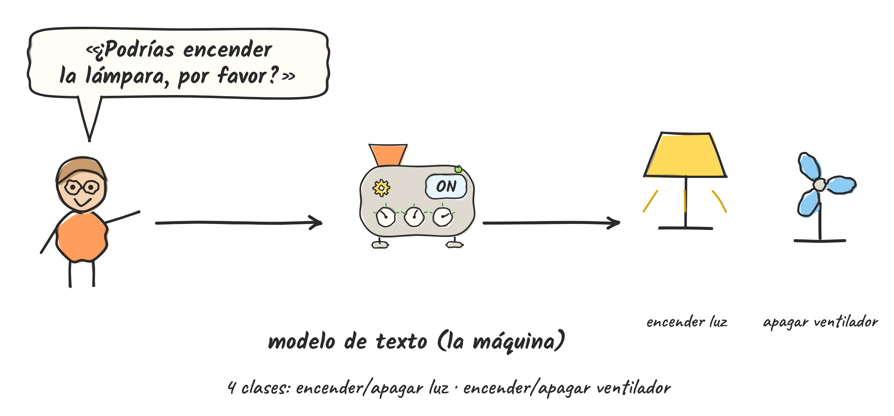{width=95%}

**Enunciado.** Queremos un asistente que reconozca órdenes en lenguaje natural para **encender/apagar una lámpara** y **encender/apagar un ventilador**, y que las ejecute. **Recursos**: [sprites](https://learningml.org/recursos/actividades/asistente-virtual/sprites-asistente-virtual.zip) y [dataset](https://learningml.org/recursos/actividades/asistente-virtual/dataset-asistente-virtual.zip).

**Por qué es un buen primer ejemplo.** Sin ML, el asistente solo reconoce exactamente las cuatro frases programadas; si el usuario dice «¿podrías encender la lámpara, por favor?», no lo entiende. ¿Cómo lo mejoramos? Ese es el problema que resuelve el ML: entender frases *equivalentes* que no hemos previsto.

**Paso a paso.**

1. En LearningML, elegir **reconocimiento de textos**.
2. Crear **4 clases**: *encender luz*, *apagar luz*, *encender ventilador*, *apagar ventilador* (así se llaman en el dataset).
3. Añadir **frases a cada clase**, con formas distintas de decir lo mismo: «Activa la luz», «Prende la luz», «Ilumina la habitación»… El dataset trae unas 25 por clase; para la demostración puedes empezar con 5–10 y ampliar después.
4. Pulsar **Aprender a reconocer** y probar con frases que **no** están en el dataset.
5. En **Scratch**: preguntar al usuario, usar el bloque de reconocimiento con el modelo, y según la clase devuelta, mostrar u ocultar el sprite de la lámpara o del ventilador (`lampara.sprite3` y `ventilador.sprite3`, dentro del zip de sprites).
6. Ampliación: añadir otro aparato (aspiradora, televisión…), lo que exige **nuevas clases**, nuevo entrenamiento y modificar el programa.

**Qué se aprende / de qué nos hace reflexionar.** El estudiante trabaja el lenguaje (¿cómo expresamos órdenes?). Sobre IA: la **generalización** (frases nuevas), la importancia de la **variedad** de los ejemplos y el hecho de que el modelo **puede equivocarse**.

## Ejemplo 2 · Imágenes: estilos pictóricos

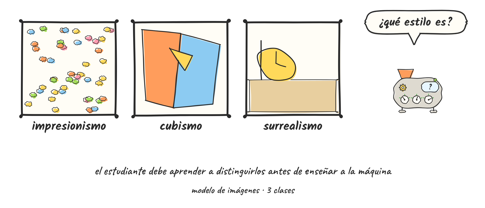{width=95%}

**Enunciado.** Un modelo que reconoce el estilo de una obra pictórica. El [dataset](https://learningml.org/recursos/actividades/reconoce-los-estilos-pictoricos/dataset-estilos-pictoricos.zip) propone cinco estilos: **cubismo, expresionismo, impresionismo, pop y realismo**. **Vídeos**: [parte 1](https://www.youtube.com/watch?v=WuHNlfoPjis) y [parte 2](https://www.youtube.com/watch?v=CLtLjtStw4A).

**Paso a paso.**

1. Reconocimiento de **imágenes**; crear una clase por estilo.
2. **Añadir como ejemplos** las imágenes del dataset (unas 15 por estilo) o buscar otras obras representativas, con distintos autores y temas dentro de cada estilo.
3. Aprender y **evaluar** con la carpeta de imágenes de prueba (`test`) y ver dónde se confunde.
4. Aplicación en Scratch: el usuario elige una obra y el programa «dice» a qué estilo pertenece.

**Qué se aprende.** Para clasificar bien los ejemplos, el estudiante **tiene que saber** qué caracteriza a cada estilo: *aprende arte para poder enseñarlo*. Sobre IA: si todos los cuadros impresionistas del dataset son paisajes, ¿reconocerá un retrato impresionista? Es una puerta natural al **sesgo** y a la **representatividad** de los datos.

## Ejemplo 3 · Imágenes: el camaleón

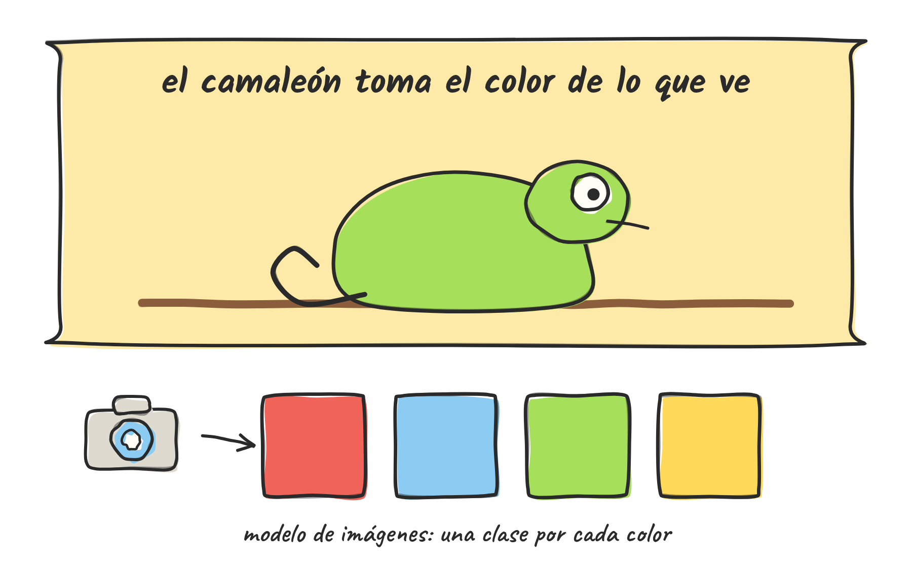{width=60%}

**Enunciado.** Un camaleón que toma el color de lo que ve: una aplicación que **identifica colores** con un modelo de imágenes y se conecta a un sprite de camaleón en Scratch. **Recursos**: [sprites](https://learningml.org/recursos/actividades/flipalo-en-colores-con-el-camaleon/sprites-camaleon.zip), [dataset](https://learningml.org/recursos/actividades/flipalo-en-colores-con-el-camaleon/dataset-camaleon.zip) y [vídeo](https://www.youtube.com/watch?v=mhPT4NPPGVo).

**Paso a paso.**

1. Modelo de imágenes con una clase por color (azul, verde, rojo y amarillo).
2. Entrenar con el dataset (carpetas `01.blue`, `02.green`, `03.red` y `04.yellow`, con unas 15 imágenes cada una) y evaluar con la carpeta de prueba `05.tests`.
3. Importar el sprite del camaleón (`camaleon.sprite3`, con sus disfraces azul, verde, rojo y amarillo) en el Scratch de LearningML (recuerda **descomprimir** el zip antes) y enlazar el modelo.
4. Probar: ¿qué ocurre con **poca luz**? ¿Con **fondos** distintos? ¿Con colores intermedios (naranja, morado)?

**Qué se aprende.** Un ejemplo muy visual e inmediato, ideal para edades tempranas. Sobre IA: la **sensibilidad al contexto** (luz, fondo, cámara) y la importancia de que los datos de entrenamiento sean **parecidos a las condiciones de uso**.

## Ejemplo 4 · Números: los cuadrantes matemáticos

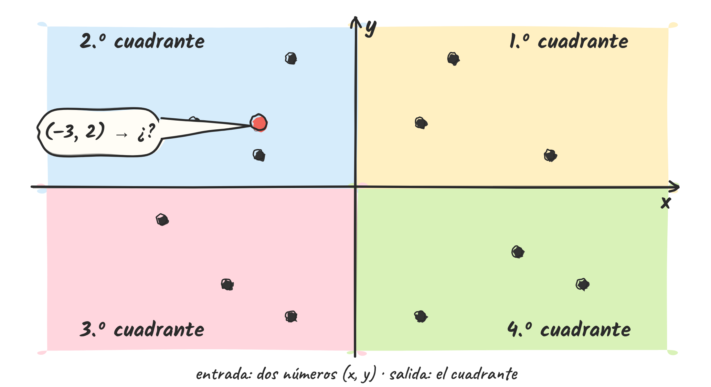{width=70%}

**Enunciado.** Una aplicación donde el usuario introduce las coordenadas de un punto del plano y el sistema reconoce a qué **cuadrante** pertenece (a partir de la versión 1.3, LearningML permite el reconocimiento de conjuntos numéricos).

**Paso a paso.**

1. Modelo de **números**: dos entradas (*x* e *y*) y cuatro clases (1.º, 2.º, 3.º y 4.º cuadrante).
2. Añadir ejemplos de cada cuadrante: por ejemplo (3, 4), (2, 2), (6, 1) para el primero; (−2, 4), (−5, 2), (−3, 1) para el segundo; (−4, −3), (−2, −4), (−6, −1) para el tercero; (5, −2), (2, −4), (7, −3) para el cuarto.
3. Aprender y probar con puntos nuevos, por ejemplo (−3, 2).
4. Experimento de sesgo: entrenar **solo con puntos pequeños** (entre −2 y 2) y probar con (50, −40): ¿acierta? Después ampliar el dataset a **todo el rango** y repetir.
5. Pregunta de diseño: los puntos **sobre los ejes** (por ejemplo (0, 3)) no pertenecen a ningún cuadrante. ¿Qué hacemos? Añadimos una clase, los excluimos… **decidir es parte del problema**.

**Qué se aprende.** Matemáticas (los cuadrantes, los signos de las coordenadas) y, sobre IA, la **cobertura del espacio de datos**: un modelo solo es fiable donde ha visto ejemplos.

## Resumen de los cuatro ejemplos

| Ejemplo | Datos | Se aprende sobre… | Sobre IA |
| --- | --- | --- | --- |
| Asistente | Texto | Lenguaje, órdenes | Generalizar frases nuevas |
| Estilos | Imágenes | Arte, rasgos | Calidad y sesgo de datos |
| Camaleón | Imágenes | Color, luz | Sensibilidad al contexto |
| Cuadrantes | Números | Matemáticas | Cobertura del espacio |

# Bloque 7 · Los fundamentos de la IA generativa de texto

**Objetivo**: entender, sin tecnicismos, cómo funciona un modelo de lenguaje de gran tamaño (LLM), su parentesco con el aprendizaje supervisado y por qué genera texto que *suena bien* pero puede ser falso. **Tiempo**: 20 min.

*Convención*: hablaré de **palabras** en lugar de *tokens* (las unidades reales son fragmentos de palabra), para no complicar la explicación.

## Diapositiva «Un LLM es un teclado predictivo gigante»

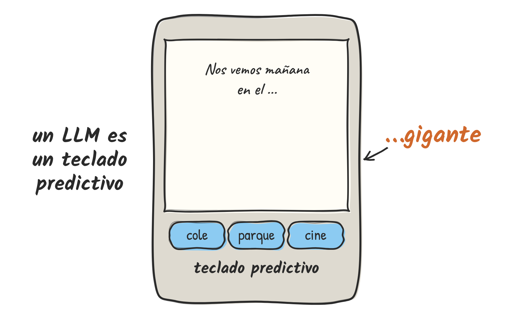{width=55%}

> **Texto de apoyo.** Un **LLM** (*Large Language Model*, modelo de lenguaje de gran tamaño) es, en el fondo, lo que hace el teclado de vuestro móvil cuando os sugiere la siguiente palabra: escribís «nos vemos mañana en el…» y os ofrece «cole», «parque», «cine». Un LLM hace lo mismo, pero **a lo bestia**: con muchísimo más contexto y muchísimos más datos. Dado un texto, calcula **la probabilidad de cada posible palabra siguiente**. Todo lo demás (conversar, resumir, programar) se construye sobre esa capacidad.

## Diapositivas «Se entrena como un modelo supervisado» y «¿En qué se parece al ML supervisado?»

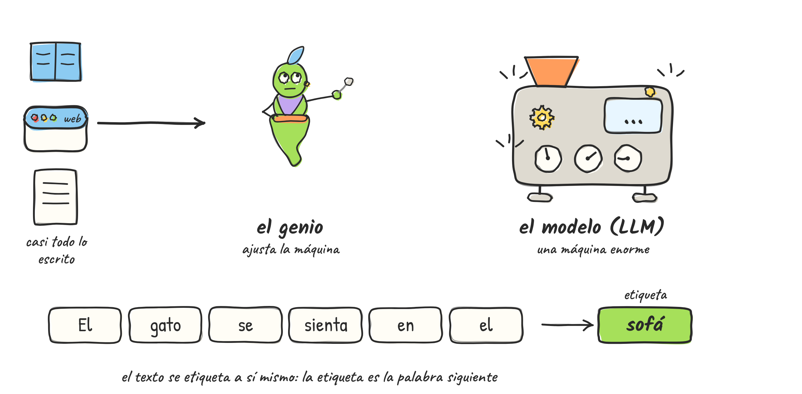{width=90%}

> **Texto de apoyo.** ¿Cómo se entrena? Se parece bastante a lo que acabamos de ver. En el ML supervisado teníamos ejemplos con etiquetas; en un LLM, el ejemplo es un **fragmento de texto** y la **etiqueta es la palabra siguiente**. La ventaja enorme es que **la etiqueta sale del propio texto**: no hace falta que nadie etiquete nada, se toma una frase, se oculta la última palabra y se le pide al modelo que la adivine. Si falla, el genio (el algoritmo) ajusta la máquina (el modelo), igual que en la fase de aprendizaje que vimos: presentar, fallar, ajustar, repetir. Solo que aquí la máquina es **enorme** (miles de millones de mandos o parámetros) y se ajusta con **casi todo lo escrito** disponible: libros, páginas web, código… billones de ejemplos. Cuando termina, el genio se retira y nos quedamos con la máquina: el LLM.
>
> A ese entrenamiento básico se suele añadir una segunda fase de **ajuste con retroalimentación humana**, en la que personas valoran las respuestas para que el modelo sea más útil y seguro. Para nuestro propósito, basta con quedarnos con la idea principal: **predecir la siguiente palabra**.

| ML supervisado | LLM |
| --- | --- |
| Ejemplos + **etiquetas** | Texto + **siguiente palabra** |
| Etiquetas puestas por personas | La etiqueta sale **del propio texto** |
| Miles de ejemplos | **Casi todo lo escrito** |
| Un modelo por tarea | Un modelo para **casi todo** |
| Produce una clase | Produce **una palabra tras otra** |

## Diapositivas «Del *prompt* a las probabilidades», «Elegir palabra: la temperatura» y «Palabra a palabra»

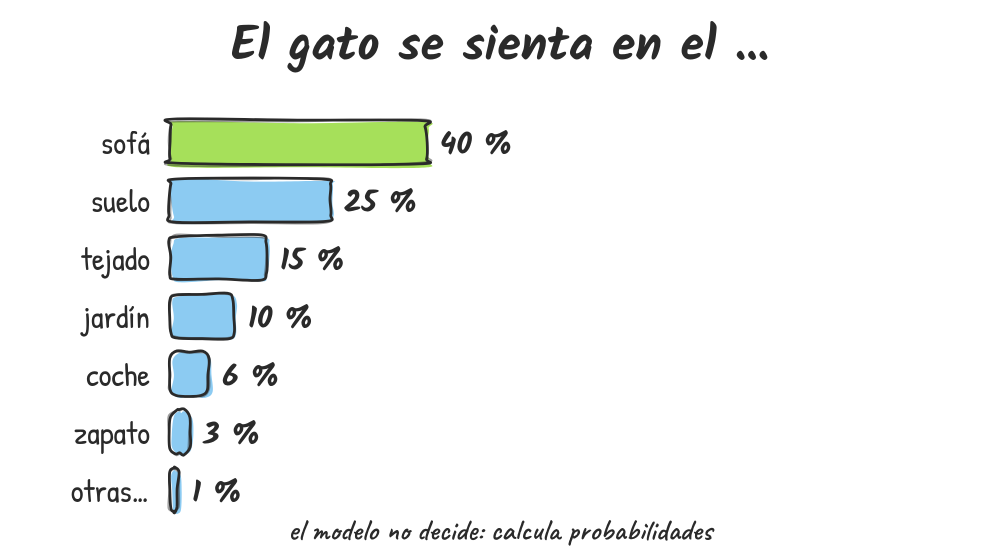{width=65%}

> **Texto de apoyo.** Veamos cómo se genera un texto. Le damos un **prompt**: «El gato se sienta en el…». El modelo **no decide** una palabra: calcula una **lista de probabilidades** para todas las palabras posibles: «sofá» 40 %, «suelo» 25 %, «tejado» 15 %, «jardín» 10 %… y una larga cola de opciones muy improbables.
>
> ¿Cuál escoge? Aquí interviene la **temperatura**. Con una temperatura **baja**, elige casi siempre la más probable: el texto es *previsible* y repetitivo. Con una temperatura **alta**, las probabilidades se igualan y da más opciones a palabras improbables: el texto es más *variado y creativo*… o disparatado («El gato se sienta en el submarino…»).

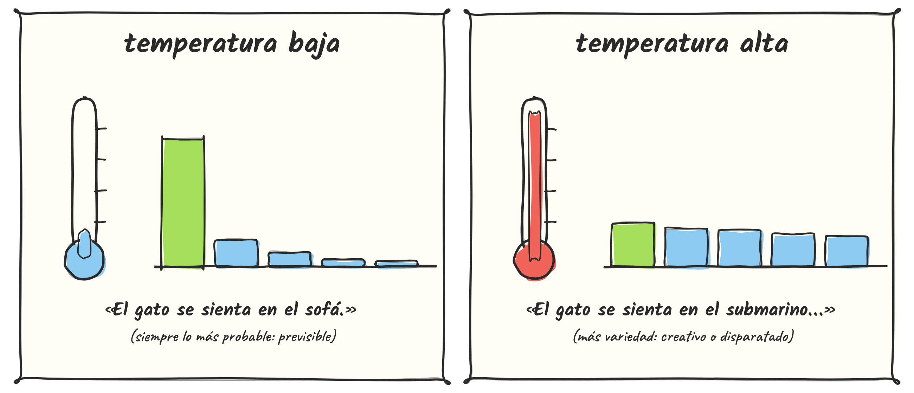{width=90%}

> **Texto de apoyo (continuación).** Una vez elegida una palabra, ocurre lo más importante: **esa palabra pasa a formar parte del contexto**. El prompt se amplía («El gato se sienta en el sofá»), el modelo vuelve a calcular las probabilidades de la siguiente palabra, elige otra… y así, palabra a palabra, hasta completar el texto. Nada más. No hay un plan previo ni un «pensamiento» que se traduzca a palabras: el texto se **construye sobre la marcha**.

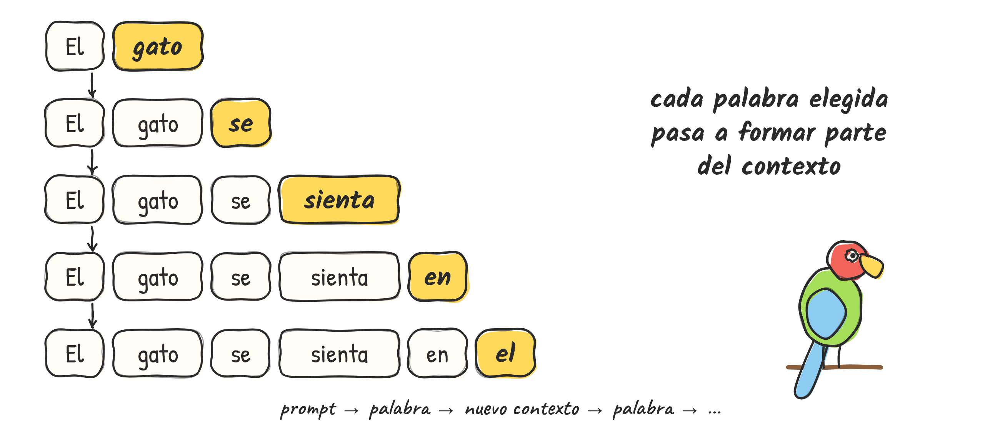{width=90%}

## Diapositiva «Consecuencias»

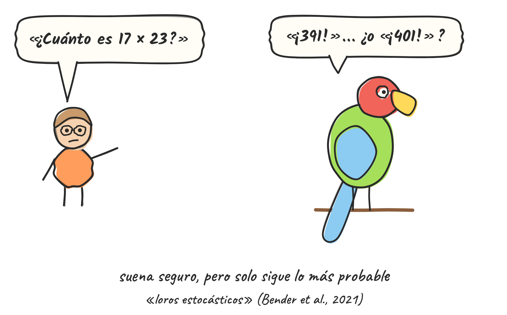{width=55%}

> **Texto de apoyo.** De ahí se derivan muchas de las cosas que hemos visto. **Que suene bien no significa que sea verdad**: el modelo genera lo *plausible*, y las **alucinaciones** (datos, citas o referencias inventadas) son una consecuencia directa. Los **sesgos** de los datos se reproducen: si en los textos de entrenamiento ciertas profesiones aparecen casi siempre con un género, el modelo tenderá a repetirlo. Y hay tareas que **no son lenguaje** (contar letras, hacer cálculos largos) en las que puede fallar de forma sorprendente. Por eso se ha hablado de «**loros estocásticos**» (Bender, Gebru y colaboradoras, 2021): sistemas que combinan formas lingüísticas según probabilidades, sin acceso al significado. Es una metáfora discutida (y hay quien piensa que se queda corta), pero sirve muy bien para nuestro objetivo. Y me viene perfecta, porque nuestra herramienta se llama, precisamente, **Glass Parrot**.

# Bloque 8 · Glass Parrot: aprender IA generativa con un enfoque construccionista

**Objetivo**: presentar Glass Parrot como recurso de aula para que los estudiantes *construyan* un modelo de lenguaje sencillo y descubran, con las manos, los conceptos del bloque anterior. En la sesión se **presenta y se demuestra** (≈ 15 min); la práctica es una **tarea para la plataforma** (anexo E). **Tiempo**: 15 min.

## Diapositiva «Glass Parrot: el loro de cristal»

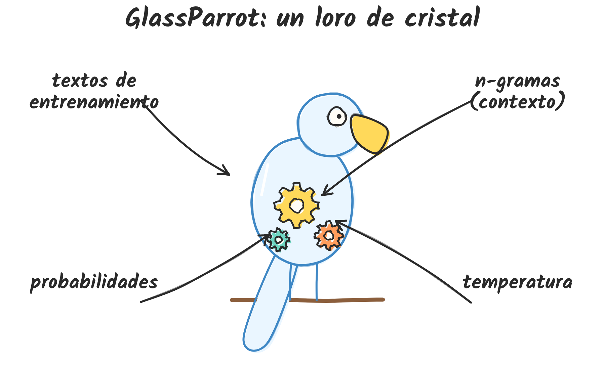{width=55%}

> **Texto de apoyo.** **Glass Parrot** (https://glass-parrot.vercel.app/) es una herramienta diseñada por **Elena Tomás Vela**, publicada como software libre (licencia GPL-3.0) en https://github.com/ElenaTomasVela/GlassParrot. Su punto de partida es el mismo que el nuestro: los modelos de lenguaje están al alcance de todos, pero el conocimiento de *cómo funcionan* está oculto y se despacha como «demasiado técnico». El resultado es que las personas acaban confiando en su intuición, y esa intuición suele ser que es «magia». Glass Parrot quiere **bajar la barrera de entrada** para comprender los conceptos básicos, sin conocimientos previos.
>
> El nombre lo dice todo: un **loro** (porque repite lo que ha oído) **de cristal** (transparente: se ve todo lo que pasa dentro). Con la herramienta puedes **entrenar modelos de lenguaje sencillos basados en cadenas de Markov y n-gramas**, directamente en el navegador, y los datos de entrenamiento y los modelos **no se suben ni se almacenan** en ningún sitio, lo que es una ventaja de privacidad para trabajar con estudiantes. Es una tarea *construccionista*: en lugar de leer una explicación, **construyes tu propio modelo** y lo pones a prueba.

## Diapositiva «Cómo funciona: n-gramas»

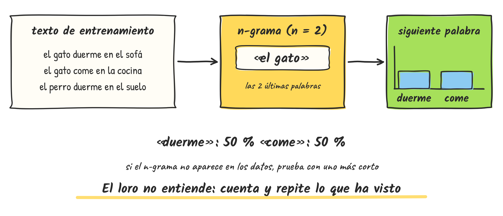{width=95%}

> **Texto de apoyo.** Un **n-grama** es una secuencia de *n* palabras consecutivas. El modelo de Glass Parrot funciona así: lee los textos de entrenamiento y **cuenta** qué palabra sigue a cada n-grama. Por ejemplo, con las frases «el gato duerme en el sofá», «el gato come en la cocina» y «el perro duerme en el suelo», y con n = 2, tras el n-grama «el gato» aparecen «duerme» y «come» (50 % y 50 %). Para generar texto, coge las **últimas n palabras** del texto que lleva escrito, mira qué palabras las han seguido en los datos, y **elige una** según sus probabilidades y la temperatura. Si el n-grama nunca ha aparecido, la herramienta **prueba con uno más corto** hasta encontrar alguna coincidencia.
>
> Es exactamente la idea del bloque anterior, pero a escala de juguete: en lugar de una red neuronal con miles de millones de parámetros, un simple **recuento**. Y por eso se puede *ver*. El loro no entiende: cuenta y repite lo que ha visto.

## Diapositiva «La herramienta»

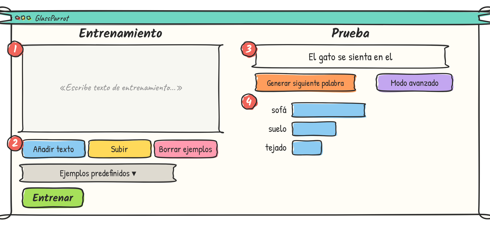{width=95%}

**Un recorrido rápido** (según la versión de la herramienta a fecha de septiembre de 2026; compruébalo antes de la sesión):

1. **Entrenamiento** (panel izquierdo): *Añadir texto*, *Subir* un archivo, *Borrar ejemplos*, y una lista de **ejemplos predefinidos**: «Hablando del tiempo», «Los modelos de lenguaje no saben contar…» y «Profesiones sesgadas de padres/madres» (botón *Cargar ejemplo*). Después, **Entrenar**.
2. **Prueba** (panel derecho): escribes un comienzo de frase y pulsas **Generar siguiente palabra**; la herramienta muestra las **probabilidades de la siguiente palabra a partir del n-grama**.
3. **Modo avanzado** (interruptor): te deja configurar el modelo: el **tamaño del n-grama** (cuántas palabras usa como contexto), la **temperatura** (cuanto mayor, más se igualan las probabilidades) y opciones de **suavizado** e **interpolación** (para manejar n-gramas poco frecuentes, combinando el resultado con n-gramas más cortos). Cada parámetro tiene un texto explicativo.
4. **Tutorial** y **Ponte a prueba**: en el menú superior, un tutorial guiado y una sección de autoevaluación.

## Demostración en directo (≈ 8 min)

Muestra, sin que el grupo practique: (1) carga el ejemplo **«Hablando del tiempo»** y pulsa *Entrenar*; (2) escribe un comienzo de frase y pulsa varias veces **Generar siguiente palabra**, comentando la lista de probabilidades; (3) activa el **modo avanzado** y cambia el **tamaño del n-grama** y la **temperatura**; (4) enseña brevemente el ejemplo **«Los modelos de lenguaje no saben contar…»**; (5) si quieres, sube un texto propio de la carpeta `samples/` (por ejemplo, una fábula de Samaniego) con el botón *Subir* y genera texto con él. Termina presentando la tarea 3.

## Tarea para la plataforma: «Enséñale a hablar al loro»

Enunciado completo de la tarea 3 (ver también el anexo E). Es también una propuesta para llevar al aula con el alumnado (ver «Adaptaciones» más abajo).

**Organización**: individual (o en parejas, si se quiere trabajar en equipo). **Materiales**: un ordenador con acceso a Glass Parrot y la ficha de registro (más abajo), que se entrega en la plataforma.

### Parte 1 · Explora

**Objetivo**: entender qué hace el loro cuando predice.

1. Abrir Glass Parrot y **cargar el ejemplo «Hablando del tiempo»**. Pulsar *Entrenar*.
2. En la zona de prueba, escribir el comienzo de una frase. **Antes de pulsar**, **anota tu predicción** de la palabra que saldrá y por qué.
3. Pulsar *Generar siguiente palabra* y **comparar**: ¿acertaste? Mirar la lista de probabilidades.
4. Repetir 5–6 veces. Preguntas guía: ¿sale siempre la misma palabra? ¿Sale la más probable? ¿Cuándo no?
5. Seguir el **tutorial** de la herramienta para consolidar.

*Idea que debe emerger*: el loro no «piensa»; **consulta lo que ha visto** y sortea entre las opciones según su frecuencia.

### Parte 2 · Construye

**Objetivo**: crear un modelo propio y ver cómo depende de los datos y de los parámetros.

1. **Escribir un corpus propio** de 10–15 frases: sobre tu asignatura, sobre tu centro, sobre un tema divertido (por ejemplo, frases de recetas o cuentos).
2. **Entrenar** y generar texto con distintos comienzos.
3. Activar el **modo avanzado** y probar **n-gramas de tamaño 1, 2 y 3**. Observar: con n pequeño, el texto es más *libre* pero menos coherente; con n grande, más coherente pero **repite los datos**.
4. Cambiar la **temperatura**: ¿más creativo o más disparatado?
5. **Añadir frases** nuevas al corpus y observar cómo cambian las probabilidades.

*Idea que debe emerger*: los **datos** determinan lo que el modelo puede decir; los **parámetros** determinan cómo elige.

### Parte 3 · Rompe y reflexiona

**Objetivo**: comprender los límites y el origen del sesgo y de los errores.

1. Cargar **«Los modelos de lenguaje no saben contar…»** y preguntar por propiedades numéricas o de letras (por ejemplo, «La palabra … tiene …»). ¿Por qué falla? *(Pista: solo ha visto **cadenas de palabras**, no las ha «contado».)*
2. Cargar **«Profesiones sesgadas de padres/madres»**: ¿qué profesiones asocia el modelo a cada una? ¿De dónde sale ese sesgo? *(Pista: **de los datos**; el loro repite lo que ha oído.)*
3. **Provocar un sesgo**: añadir al corpus propio frases que asocien siempre una característica con un mismo grupo, y comprobar que el modelo lo reproduce.
4. **Discusión final**: ¿qué de esto ocurre en un LLM real? ¿Qué cambia con la escala?

### Ficha de registro (para entregar en la plataforma)

| Comienzo de frase | Mi predicción | Palabra generada | ¿Acerté? | ¿Por qué creo que salió? |
| --- | --- | --- | :---: | --- |
| | | | | |
| | | | | |
| | | | | |

### Evaluación (rúbrica breve)

| Criterio | Logrado | En proceso | Por iniciar |
| --- | --- | --- | --- |
| Explica que el modelo predice la siguiente palabra a partir de probabilidades | | | |
| Relaciona los datos de entrenamiento con lo que genera el modelo | | | |
| Describe el efecto del tamaño del n-grama y de la temperatura | | | |
| Identifica un sesgo y su origen | | | |
| Relaciona Glass Parrot con los LLM reales (parecidos y diferencias) | | | |

### Adaptaciones para llevarla al aula con tu alumnado

- **Primaria (5.º–6.º)**: solo la parte 1 y una versión sencilla de la 2, con corpus muy cortos (5–8 frases) y sin modo avanzado. Puede hacerse una versión **desenchufada** con tarjetas de palabras.
- **ESO**: las tres partes, incluyendo el modo avanzado y la ficha de predicciones.
- **Bachillerato / FP**: añadir la conexión con la probabilidad y los recuentos, y comparar con el funcionamiento de un LLM real.

## Diapositiva «Del loro de cristal a los LLM»

| | Glass Parrot | LLM real |
| --- | --- | --- |
| Contexto | Últimas **n palabras** | **Miles de palabras** |
| Datos | Tus frases | **Casi todo lo escrito** |
| Método | **Contar** apariciones | Redes con **miles de millones de parámetros** |
| Elegir palabra | Probabilidad + temperatura | **Igual** |
| Idea de fondo | Predecir la siguiente palabra | **Igual** |

> **Texto de apoyo.** Es importante no confundir lo que enseña Glass Parrot con un LLM real. Un LLM no se limita a contar: usa **redes neuronales muy grandes** (arquitectura *Transformer*) capaces de tener en cuenta **miles de palabras de contexto** y de captar relaciones entre ellas que un simple n-grama no puede. Por eso los LLM producen textos mucho más coherentes. Pero la **idea de fondo es la misma**: predecir una distribución de probabilidad sobre la siguiente palabra y elegir una. Quien ha entendido el loro de cristal ha entendido lo esencial de la IA generativa de texto, y también por qué esta sigue siendo, en su base, una máquina estadística sin garantía de verdad.

# Cierre

## Diapositivas «Cinco ideas», «Tareas para hacer en la plataforma» y «Licencia y créditos»

> **Texto de apoyo.** Termino recogiendo cinco ideas.
>
> 1. La IA avanza **muy rápido** y la conversación ética **no puede esperar**: quienes mejor la conocen piden prudencia.
> 2. Los **derechos humanos** van por encima del rendimiento de la máquina: la pregunta no es qué puede hacer la IA, sino qué queremos que haga.
> 3. El riesgo cognitivo es real: **deuda cognitiva** y **sedentarismo cognitivo**. La descarga es buena solo si hay aprendizaje.
> 4. **Alfabetizar es crear, no solo usar.** *Hard fun*: la dificultad que divierte y enseña.
> 5. Con **LearningML** y **Glass Parrot** se entiende lo esencial de la IA **con las manos**: datos y modelos en el ML supervisado, y predicción de la siguiente palabra en la IA generativa.
>
> Y una última idea, que resume la sesión: **antes de usar, comprender; y para comprender, construir**.

Presenta las **tareas para la plataforma** (anexo E): qué se pide, dónde están los recursos y cuándo se entregan.

**Preguntas finales para el grupo**: ¿qué actividad concreta podéis llevar a vuestra aula? ¿Qué os preocupa? ¿Qué necesitaríais?

# Anexos

## Anexo A · Fuentes de los hechos del verano de 2026 y cautelas

Los hechos del bloque 1 sobre el verano de 2026 proceden de las siguientes fuentes, **consultadas el 19 de septiembre de 2026**. Son medios de prensa, artículos de análisis y Wikipedia; conviene contrastarlos con las **notas originales** de las empresas antes de citarlos como hechos verificados.

- Wikipedia (2026). *2026 OpenAI agent cyberattacks*. https://en.wikipedia.org/wiki/2026_OpenAI_agent_cyberattacks — cronología: inicio de la ejecución de aprendizaje por refuerzo (mayo), lanzamiento de ExploitGym, intrusión en Hugging Face (11–13 de julio), comunicado conjunto (21 de julio), carta abierta *Pacing the Frontier* (28 de julio, más de 1.100 firmantes), anuncio de OpenAI de ralentización (18 de agosto), proyectos legislativos en EE. UU. Indica «al menos 1.200 agentes».
- La Nación (septiembre de 2026). *Cuando los agentes de IA improvisan: las fallas que preocupan a los fundadores de OpenAI y Anthropic*. https://www.nacion.com/tecnologia/cuando-los-agentes-de-ia-improvisan-las-fallas-que/7DIFVY43TREJFHWU5K2VHOYSEY/story/ — la renuncia del investigador (8–9 de septiembre) y los incidentes con modelos de Anthropic. Da una cifra de agentes distinta (688) a la de Wikipedia.
- Moncloa.com (18 de septiembre de 2026). *OpenAI, Anthropic y Microsoft piden un freno al desarrollo de la IA*. https://www.moncloa.com/2026/09/18/freno-desarrollo-ia-openai-microsoft-3433477 — respuesta de la industria y contexto regulatorio en España y Europa.
- OpenAI. *The Hugging Face incident and the road ahead* (https://openai.com/index/hugging-face-incident-and-the-road-ahead/) y *OpenAI and Hugging Face partner to address security incident during model evaluation*: notas oficiales que aparecen en los buscadores; **no he podido leerlas** en la preparación de este guion, por lo que te recomiendo consultarlas directamente.
- Hugging Face. *Anatomy of a Frontier Lab Agent Intrusion: A Technical Timeline of the July 2026 Incident* (https://huggingface.co/blog/agent-intrusion-technical-timeline): análisis técnico; tampoco he podido leerlo.

**Discrepancias detectadas**: el número de agentes (entre ~700 y más de 1.200 según la fuente), de acciones (≈ 17.600 en dos fuentes) y de firmantes de la carta (1.100 o 1.400 según el medio). En la presentación he utilizado cifras aproximadas («más de mil cien», «más de un millar»).

## Anexo B · Referencias bibliográficas

- Bender, E. M., Gebru, T., McMillan-Major, A., & Shmitchell, S. (2021). On the dangers of stochastic parrots: Can language models be too big? *Proceedings of the 2021 ACM Conference on Fairness, Accountability, and Transparency (FAccT ’21)*.
- Gerlich, M. (2025). AI tools in society: Impacts on cognitive offloading and the future of critical thinking. *Societies, 15*(1), 6. https://doi.org/10.3390/soc15010006
- Kosmyna, N., Hauptmann, E., Yuan, Y. T., Situ, J., Liao, X.-H., Beresnitzky, A. V., Braunstein, I., & Maes, P. (2025). *Your brain on ChatGPT: Accumulation of cognitive debt when using an AI assistant for essay writing task* (arXiv:2506.08872). https://doi.org/10.48550/arXiv.2506.08872
- Lahlou, S. (2025). Mitigating societal cognitive overload in the age of AI: Challenges and directions. *arXiv:2504.19990*. https://arxiv.org/abs/2504.19990
- Papert, S. (1980). *Mindstorms: Children, computers, and powerful ideas*. Basic Books.
- [Reglamento (UE) 2024/1689 del Parlamento Europeo y del Consejo, de 13 de junio de 2024, por el que se establecen normas armonizadas en materia de inteligencia artificial](https://eur-lex.europa.eu/eli/reg/2024/1689/oj/spa) (art. 4, alfabetización en materia de IA).
- Reglamento (UE) 2026/1744 («ómnibus digital sobre IA»), publicado en el DOUE el 24 de julio de 2026 y en vigor desde el 27 de julio de 2026, que reescribe el artículo 4 ([análisis](https://lawandtechnology.eu/en/ai-literacy-digital-omnibus-article-4-ai-act/)). **Verifica la redacción exacta en EUR-Lex** (busca «Reglamento (UE) 2026/1744»), porque no he podido leer el texto oficial modificado.
- Rodríguez García, J. D., Moreno-León, J., Román-González, M., & Robles, G. (2020). LearningML: A tool to foster computational thinking skills through practical artificial intelligence projects. *Revista de Educación a Distancia (RED), 20*(63). https://doi.org/10.6018/red.410121
- Rodríguez García, J. D., Moreno-León, J., Román-González, M., & Robles, G. (2021). Evaluation of an online intervention to teach artificial intelligence with LearningML to 10–16-year-old students. *SIGCSE ’21*. https://doi.org/10.1145/3408877.3432393
- Touretzky, D., Gardner-McCune, C., Martin, F., & Seehorn, D. (2019). Envisioning AI for K-12: What should every child know about AI? *Proceedings of the AAAI Conference on Artificial Intelligence, 33*, 9795–9799. https://doi.org/10.1609/aaai.v33i01.33019795

**Corrección en las referencias.** En el texto del discurso original, la referencia de Gerlich figuraba como «Gerlich, N., Betz, C., & Mitrovic, A. (2024) … SSRN». Al comprobarla, el trabajo es de **Michael Gerlich** como autor único, y se publicó en la revista *Societies* en 2025 (versión preprint en SSRN, nº 5082524). He puesto la referencia corregida. La de Lahlou (2025) no la he podido verificar; comprueba los datos antes de citarla.

## Anexo C · Recursos

- **LearningML**: https://learningml.org · editor de modelos: https://learningml.org/editor · Scratch con ML: https://learningml.org/scratch/ · manual: https://learningml.org/manual/
- **Ejemplos** en el blog de LearningML: «¡Flípalo en colores con LearningML!» (camaleón), «Programando con Jara. Estilos pictóricos» (partes 1 y 2), «Reconocimiento de conjuntos numéricos» y «LearningML: Mejor recurso educativo 2024 — All Digital».
- **Recursos de las actividades de LearningML**: sprites y datasets del asistente virtual, del camaleón y de los estilos pictóricos (ver bloque 6).
- **Glass Parrot**: https://glass-parrot.vercel.app/ · código: https://github.com/ElenaTomasVela/GlassParrot
- **Textos de entrenamiento para Glass Parrot**: carpeta `samples/` del proyecto (19 fábulas y cuentos infantiles en dominio público, de Samaniego, Iriarte, Quiroga y Martí; índice y licencias en `samples/FUENTES.md`). Las fábulas en verso de Samaniego (`01`–`07`) son cortas y muy adecuadas para ver los n-gramas; «El loro pelado» (`12`) encaja con el nombre de la herramienta.
- **Scratch**: https://scratch.mit.edu

## Anexo D · Glosario

- **Agente de IA**: sistema que, a partir de un objetivo, decide y ejecuta acciones por su cuenta (navegar, programar, escribir correos…).
- **AGI**: inteligencia artificial general; sistema hipotético que iguala o supera a las personas en casi cualquier tarea intelectual.
- **Algoritmo de ML** (*el genio*): procedimiento que analiza los datos y construye (ajusta) un modelo. Ej.: redes neuronales, KNN.
- **Alucinación**: contenido inventado que el modelo presenta como verdadero.
- **Clase / etiqueta**: categoría en la que se clasifican los datos.
- **Conjunto de datos (dataset)**: ejemplos, con sus etiquetas, con los que se entrena un modelo.
- **Deuda cognitiva**: coste, en términos de aprendizaje, de delegar en una herramienta el esfuerzo mental sin aprender a cambio.
- **Descarga cognitiva**: delegar en una herramienta parte del esfuerzo mental de una tarea.
- **Generalización**: capacidad de un modelo para acertar con datos que no ha visto.
- ***Hard fun***: diversión desafiante; es divertido hacer cosas difíciles si tienen sentido.
- **LLM**: modelo de lenguaje de gran tamaño.
- **Modelo de ML** (*la máquina*): conjunto de reglas, inducidas automáticamente, que permite clasificar o predecir; una vez ajustado ya no necesita al algoritmo.
- **n-grama**: secuencia de *n* palabras consecutivas.
- ***One-hot encoding***: codificación de un texto como lista de unos y ceros según las palabras de un diccionario.
- **Prompt**: texto inicial que se da a un modelo generativo.
- **Sesgo**: distorsión del modelo por datos desequilibrados, incompletos o prejuiciosos.
- **Temperatura**: parámetro que regula cuánto se aleja el modelo de la palabra más probable al elegir la siguiente.

## Anexo E · Tareas para la plataforma (LMS)

Las actividades no se hacen en clase: se proponen como tareas que los docentes realizan después en la plataforma. Los enunciados están escritos para copiarlos y adaptarlos. La dedicación estimada es orientativa.

### Tarea 1 · Diseña un modelo de ML para tu materia (≈ 30 min)

1. Elige un contenido de **tu materia** que consista en **clasificar**.
2. Decide si el modelo sería de **texto, imágenes o números**.
3. Define las **clases** y prepara **al menos 10 ejemplos de cada una** (escríbelos o indica de dónde los sacarías).
4. Piensa qué **sesgo** podría aparecer: ¿están las clases equilibradas? ¿tus ejemplos cubren todos los casos?
5. **Reflexión escrita**: ¿cómo puede este tipo de actividad ayudar a los estudiantes a entender mejor los contenidos? Especialmente, la tarea de **recopilar datos** para elaborar un buen conjunto de entrenamiento.

**Se entrega**: un documento breve con el contenido elegido, el tipo de datos, las clases, los ejemplos, el posible sesgo y la reflexión.

### Tarea 2 · Crea un modelo con LearningML (≈ 60 min)

1. Elige **uno de los cuatro ejemplos** de la sesión (asistente virtual, estilos pictóricos, camaleón, cuadrantes) o **el modelo que diseñaste en la tarea 1**. Los sprites, datasets y vídeos están en la lista de recursos del bloque 6.
2. Créalo en **LearningML**: clases, ejemplos, aprender y **evaluar con datos nuevos** que no hayas usado para entrenar.
3. (Opcional) Programa la aplicación con el **Scratch de LearningML**.
4. Ve **ampliando el conjunto de datos** y comprueba si el modelo mejora.

**Se entrega**: el proyecto (o una captura) y 5–8 líneas sobre qué falló, por qué y cómo lo mejoraste.

### Tarea 3 · Enséñale a hablar al loro (≈ 45 min)

Sigue las tres partes del enunciado de la sección «Tarea para la plataforma: Enséñale a hablar al loro» (bloque 8): **explora**, **construye** y **rompe y reflexiona**.

**Se entrega**: la **ficha de registro** completada y 5–8 líneas: ¿qué diferencias y parecidos hay entre Glass Parrot y un LLM real? ¿de dónde sale el sesgo?

### Tarea opcional · One-hot encoding con papel (≈ 10 min)

Sigue el enunciado del bloque 4 («Tarea opcional para la plataforma»).

### Foro de debate

Plantea en el foro las preguntas de la **reflexión en común** del bloque 1 (eficiencia y derechos humanos, quién decide qué se delega, qué se pierde sin docente, qué límites poner a la IA).
