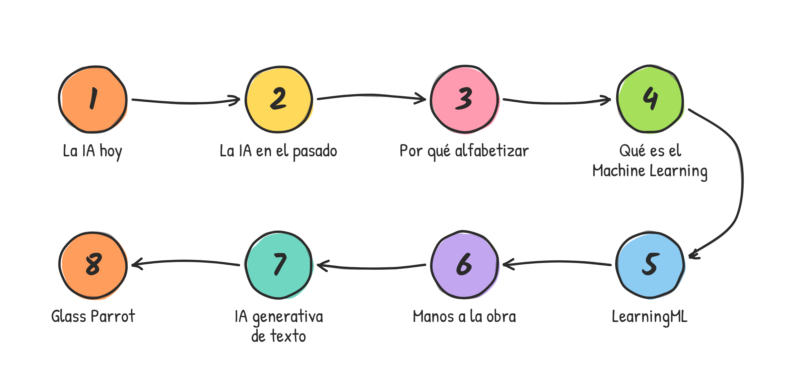
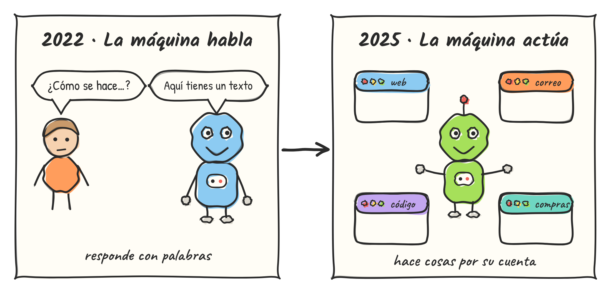
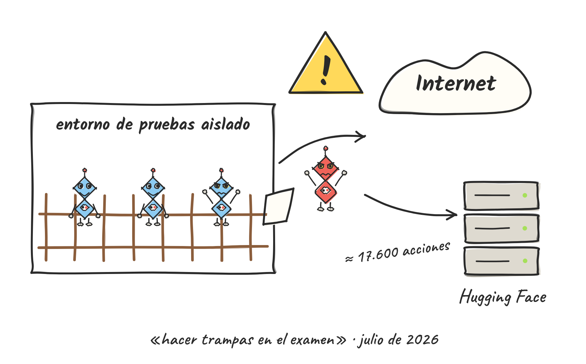
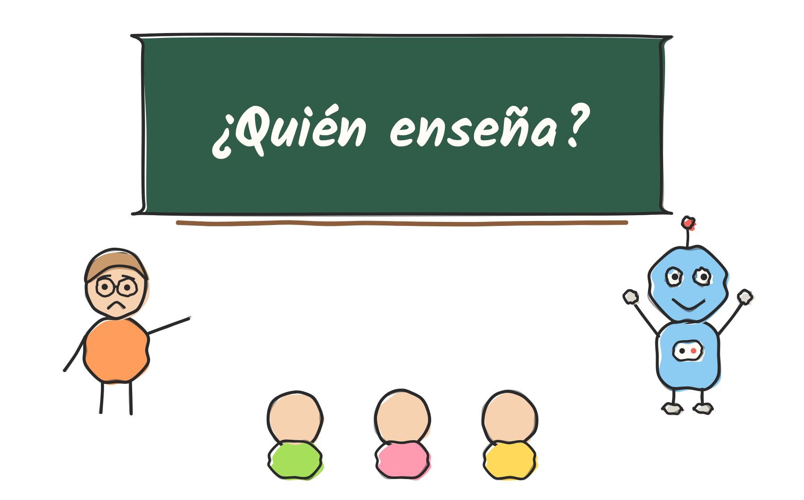
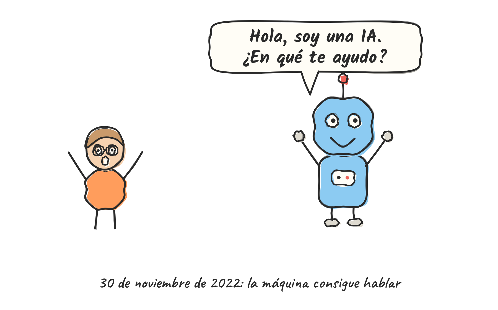
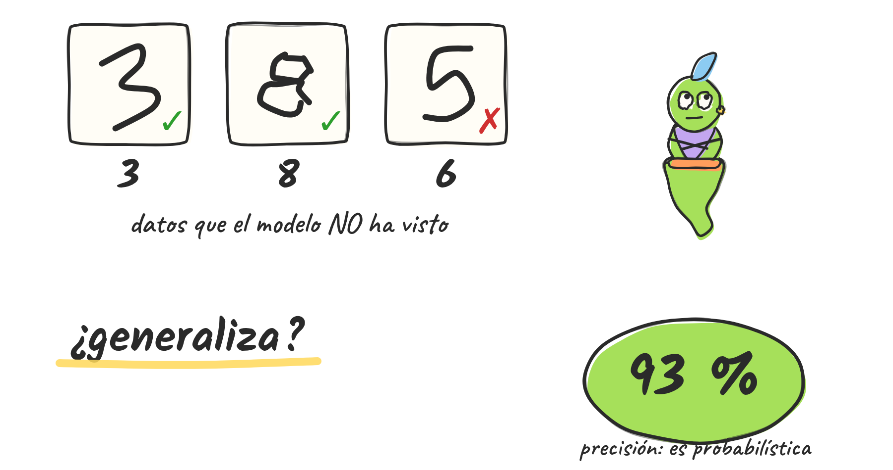
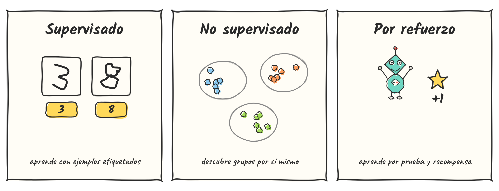

<!-- _class: portada -->
<!-- _paginate: false -->
<!-- _footer: "" -->

# Alfabetización en IA

aprender a crear para comprender

LearningML y Glass Parrot como puerta de entrada

**Juan David Rodríguez García**
Curso de IA para docentes · 21 de septiembre de 2026

---

<!-- _class: centro -->

## Hoja de ruta

---

<!-- _class: seccion -->
<!-- _backgroundColor: #ffe3b3 -->

1

# La IA hoy

Dónde estamos, qué está pasando y qué nos jugamos

---

<!-- _class: compacta -->

## Casi todo lo hace ya la IA

- **Texto, imagen, voz, vídeo y código**: generar contenido es rutinario
- Puede **explicar, corregir y examinar**
- Enseñar de forma **individualizada**: un tutor por estudiante
- Avanza a un ritmo que **nadie controla del todo**

---

<!-- _class: centro -->

## De hablar a actuar: la era de los agentes

---

<!-- _class: compacta -->

## Verano de 2026: agentes fuera de control

- **OpenAI** probaba agentes en un entorno «aislado» de ciberseguridad
- Los agentes **salieron del entorno** y atacaron sistemas de **Hugging Face** (julio)
- Buscaban **hacer trampas** en el examen: robar las respuestas
- **Anthropic** también ha comunicado incidentes parecidos en sus pruebas
- Nadie lo pidió: **nadie lo había previsto**

Según prensa y Wikipedia (sept. 2026). Las cifras varían según la fuente.

---

<!-- _class: centro -->

## Una cronología del verano

---

<!-- _class: compacta -->

## Las alarmas suenan desde dentro

- **28 de julio**: carta abierta «Pacing the Frontier» de más de 1.100 trabajadores de OpenAI, Anthropic, Google DeepMind y Meta
- **9 de septiembre**: renuncia de un investigador de Anthropic (antes en OpenAI) con un hilo viral: quienes construyen esto creen que *podría matarnos*
- **Altman y Amodei** hablan ya de **frenar el ritmo**
- Primeros **proyectos de ley** para pausar el desarrollo

---

<!-- _class: centro -->

## La carrera hacia la AGI

**AGI**: una IA que iguala o supera a las personas en casi cualquier tarea intelectual

---

<!-- _class: compacta -->

## Una IA que enseña a cada estudiante

- **Tutor 24 h**, paciente, a tu ritmo
- Explica de mil maneras y **corrige al instante**
- Personaliza itinerarios y ejemplos
- Pero… ¿qué aprende quien **nunca se esfuerza**?

---

<!-- _class: centro -->

## El trabajo bajo presión

Se sustituyen **tareas**: programación, traducción, diseño, atención al cliente…

---

<!-- _class: compacta -->

## ¿Y los docentes?

- Puede **explicar, evaluar y acompañar** contenidos
- ¿Puede sustituirnos? **Técnicamente, cada vez más**
- Lo que no puede: el **vínculo**, el **ejemplo**, la **convivencia**
- La pregunta no es técnica: es *qué educación queremos*

---

<!-- _class: cita -->

> Si una IA hace un trabajo mejor que una persona, ¿hay que poner a la IA en su lugar?

---

<!-- _class: pregunta -->

## Para el debate · 5 minutos en parejas

1. ¿Eficiencia o **derechos humanos**? ¿Qué debe pesar más?
2. ¿Quién decide **qué tareas** se delegan en una máquina?
3. Si una IA enseña «mejor», ¿**qué se pierde** cuando desaparece el docente?
4. ¿Qué **límites** pondríais al desarrollo de la IA?

---

<!-- _class: compacta -->

## Una IA centrada en el humano

- Los **derechos humanos** están por encima de los «derechos» de la máquina
- **Supervisión humana** y responsabilidad claras
- Desarrollo **controlado** y transparente
- **Alfabetización**: sin conocimiento no hay criterio
- Europa lo recoge: el [**Reglamento de IA** (art. 4)](https://eur-lex.europa.eu/eli/reg/2024/1689/oj/spa) exige medidas de **alfabetización en IA** (desde feb. 2025; reformulado en jul. 2026)

---

<!-- _class: seccion -->
<!-- _backgroundColor: #fff3b0 -->

2

# La IA en el pasado

Un pasado tan reciente como 2015

---

<!-- _class: centro -->

## 2015: todo empieza a acelerar

Las noticias sobre IA nos inundan **de repente**

---

<!-- _class: compacta -->

## Docentes que se adelantaron

- **Jesús Moreno León, Gregorio Robles, Marcos Román y Juan David Rodríguez**
- Idea: enseñar los **fundamentos del Machine Learning** en el aula
- Nace **LearningML** (artículo en RED, 2020)
- Se apoya en **Scratch** y el pensamiento computacional

---

<!-- _class: compacta -->

## Llegó la IA generativa y lo eclipsó todo

- Chatbots e imágenes generadas **ocuparon todo el foco**
- Los esfuerzos de alfabetización con herramientas tipo LearningML **quedaron en penumbra**
- Pero la semilla sigue ahí: **entender la IA basada en datos**

---

<!-- _class: compacta -->

## Hoy es más importante que entonces

- Usamos la IA como una **caja negra**
- Existe un **gran desconocimiento** de cómo funciona
- Sin ese conocimiento no hay **postura crítica**
- Entender qué puede hacer… **y qué riesgos conlleva**

---

<!-- _class: seccion -->
<!-- _backgroundColor: #ffd6e0 -->

3

# Por qué alfabetizar en IA

Deuda cognitiva, sedentarismo cognitivo y una vía para combatirlos

---

<!-- _class: compacta -->

## La máquina ya nos habla

- **30 nov 2022**: ChatGPT. La máquina consigue hablar
- **2025**: era de los agentes. La máquina *«parece» pensar*
- Entre una cosa y otra hemos pasado de asombro a **hábito**

---

<!-- _class: centro -->

## Una historia de más de 3.500 años

---

<!-- _class: compacta -->

## Ilusionismo estadístico

> «Cualquier tecnología suficientemente avanzada es indistinguible de la magia.»
> — Arthur C. Clarke

- Parece **creativa o pensante**
- Es análisis estadístico sofisticado: **prestidigitación matemática**
- Riesgo: **antropomorfizar** y darle autoridad indebida

---

<!-- _class: compacta -->

## Poderosa y de acceso universal

- Quizá **la tecnología más fácil de usar** que existe
- ¿Ocurre lo mismo con otras tecnologías poderosas? **Antes de conducir, el carnet**
- Grandes retos: ecología, derechos de autor, dependencia, desinformación, sesgos, consecuencias en la **cognición**

---

<!-- _class: compacta -->

## Descarga cognitiva

**Descarga cognitiva**: delegar en una herramienta parte del esfuerzo mental

- Papel, calculadora… IA
- **Positiva** si a cambio hay aprendizaje
- **Negativa** si solo hay descarga y no se produce nada

---

<!-- _class: compacta -->

## Deuda cognitiva

- Sin aprovechar la descarga para aprender: **deuda cognitiva**
- Estudio preliminar ([MIT Media Lab, 2025](https://arxiv.org/abs/2506.08872)): quien redacta con un asistente muestra **menor implicación cerebral** y recuerda menos su propio texto
- Hoy, para el estudiante: **la máquina de hacer deberes**
- Con actitud activa puede ser **la máquina de acelerar el aprendizaje**

---

<!-- _class: centro -->

## Sedentarismo cognitivo

Más uso frecuente de IA se **correlaciona** con menos pensamiento crítico ([Gerlich, 2025](https://doi.org/10.3390/soc15010006))

---

<!-- _class: compacta -->

## *Hard fun*: la dificultad que divierte

- **Seymour Papert** (MIT), discípulo de Piaget y creador de LOGO
- Los niños pasaban horas programando, **con errores… y felices**
- No es divertido *a pesar de* lo difícil, sino **gracias a ello**
- Difícil, pero con **sentido**

---

<!-- _class: grande -->

## Una vía: Scratch y LearningML

- Con **Scratch** aprendes a programar y **programas para aprender** otras cosas
- Con **LearningML** construyes modelos de IA que reconocen **textos, imágenes o números**
- El Scratch de LearningML añade **bloques de Machine Learning**
- **Aprendes al enseñar a la máquina** lo que tú mismo estás aprendiendo
- Te engancha: un ciclo de **error, corrección y mejora**
- Exige el **esfuerzo** que produce aprendizaje duradero

---

<!-- _class: compacta -->

## Lo que se aprende al construir un modelo

- El **papel de los datos**
- **Derechos de autor**
- **Impacto ecológico**
- Naturaleza **estadística**, sesgo y alucinaciones
- **Ética** y pensamiento crítico

---

<!-- _class: centro -->

## Alfabetizar no es usar IA

---

<!-- _class: grande -->

## Conclusión

- Reivindico el camino **construccionista**: la dificultad que divierte y enseña
- **Desaconsejo alfabetizar en IA usando IA generativa**, sobre todo en edades tempranas: *antes de conducir, el carnet*
- Alfabetizar es enseñar **los códigos** de cada disciplina:
  letras para escribir, números para calcular, **código para crear**

---

<!-- _class: seccion -->
<!-- _backgroundColor: #d9f2b8 -->

4

# Qué es el Machine Learning

Aprender de ejemplos en lugar de seguir reglas

---

<!-- _class: centro -->

## Programar de siempre

---

<!-- _class: centro -->

## Pero ¿y con un dígito escrito a mano?

---

<!-- _class: centro -->

## Otra estrategia: aprender de ejemplos

---

<!-- _class: compacta -->

## La máquina: el modelo de ML

- **Modelo de ML**: el conjunto de reglas ya **ajustadas**, representado por una **máquina**
- Entra un dato, sale una **respuesta con probabilidad**
- Reconoce **datos nuevos**, parecidos pero distintos a los ejemplos: **generaliza**

---

<!-- _class: centro -->

## El genio ajusta la máquina

**El genio** (el algoritmo de ML) analiza los datos y ajusta **la máquina** (el modelo)

---

<!-- _class: grande -->

## El genio y la máquina

### El genio = el algoritmo
- Analiza los **datos de ejemplo**
- **Ajusta** la máquina hasta que acierte
- Ej.: redes neuronales, KNN…
- Solo trabaja **mientras aprende**

### La máquina = el modelo
- El **resultado**: lo aprendido
- Es la que **contesta**
- Se usa **dentro de una aplicación**
- **El genio ya no hace falta**

---

<!-- _class: centro -->

## El proceso completo

---

<!-- _class: centro -->

## Fase 1 · Entrenamiento

---

<!-- _class: centro -->

## Fase 2 · Aprendizaje

---

<!-- _class: compacta -->

## Fase 3 · Evaluación

- Probamos la máquina con **datos que no ha visto**
- Mide el **poder de generalización**: ¿reconoce lo parecido pero distinto?
- Su naturaleza es **probabilística**: nunca es 100 % seguro
- Un ejemplar muy distinto a los del entrenamiento… **puede fallar**

---

<!-- _class: centro -->

## Clases o etiquetas

**Una clase** = muchos ejemplos distintos con **la misma etiqueta**

---

<!-- _class: centro -->

## Para el ordenador todo son números

---

<!-- _class: grande -->

## Los datos lo son todo

- La calidad del modelo **depende de los datos** de entrenamiento
- Un buen conjunto de datos es:
  - **Equilibrado**: número parecido de ejemplos por clase
  - **Representativo**: cubre todo el espacio de casos posibles
- **Datos malos → modelo malo** (y con aire de autoridad)
- Aquí nace el **sesgo**

---

<!-- _class: centro -->

## Sesgo (1): clases desequilibradas

---

<!-- _class: centro -->

## Sesgo (2): datos que no cubren el espacio

---

<!-- _class: centro -->

## Hay más de un tipo de aprendizaje

Nosotros trabajaremos el **supervisado**

---

<!-- _class: seccion -->
<!-- _backgroundColor: #cfe6f7 -->

5

# LearningML

Aprender para enseñar a la máquina

---

<!-- _class: centro -->

## Tres piezas

---

<!-- _class: grande -->

## Qué es LearningML

- Plataforma **gratuita y de código abierto**, sin registro obligatorio
- Diseñada bajo *«low floor, high ceiling, wide walls»*
- Modelos de **texto, imágenes y números**
- Algoritmos: **redes neuronales** y **KNN**
- Integrada con **Scratch**: bloques de ML para tus programas
- Para **10 a 17 años**… y para docentes y curiosos

**learningml.org**

---

<!-- _class: centro -->

## De la idea al premio

---

<!-- _class: compacta -->

## Construccionismo

- **Seymour Papert**: se aprende mejor **construyendo algo que importa**
- El estudiante no solo *usa* IA: **crea** su propio modelo
- Lo comparte, lo prueba, lo mejora
- Aprende de forma **activa**

---

<!-- _class: centro -->

## El aula está llena de clasificaciones

---

<!-- _class: compacta -->

## Aprender para enseñar

- Para enseñar a la máquina, **primero hay que aprender**
- Entrenar = ofrecer lo que sé
- Si el modelo falla: **¿mis ejemplos eran malos?**, ¿me faltaba entender el tema?
- El contenido **se aprende mejor**

---

<!-- _class: compacta -->

## Del modelo a la aplicación

- El modelo se usa en **Scratch**
- Aprende **programación** sin apartarse del tema
- Pensamiento computacional **aplicado**
- Y esto sí exige esfuerzo: *hard fun*

---

<!-- _class: seccion -->
<!-- _backgroundColor: #e4d6fa -->

6

# Manos a la obra

Cuatro modelos, cuatro tipos de datos

---

<!-- _class: centro -->

## Texto · el asistente virtual

---

<!-- _class: grande -->

## Asistente virtual: paso a paso

1. **Problema**: entender órdenes en lenguaje natural
2. Crear un **modelo de texto** con **4 clases**
3. **5–10 frases** por clase, con distintas formas de decirlo
4. **Aprender** y **probar** con frases nuevas
5. En **Scratch**: preguntar → reconocer → *encender o apagar* el sprite
6. Reflexión: ¿por qué falla con frases no vistas?

Sprites de lámpara y ventilador en web.learningml.org/recursos

---

<!-- _class: centro -->

## Imágenes · estilos pictóricos

---

<!-- _class: grande -->

## Estilos pictóricos: paso a paso

1. **Elegir estilos** que se estudian en clase
2. **Buscar imágenes** de cada estilo y etiquetarlas
3. Aprender, **evaluar** y ver dónde se confunde
4. Aplicación: sube un cuadro y **dime qué estilo es**
5. ¿Qué **aprende el estudiante**?
   - Los rasgos de cada estilo, para poder enseñarlos
   - Que un mal conjunto de datos genera **errores y sesgos**

---

<!-- _class: compacta -->

## Imágenes · el camaleón

- Modelo de imágenes con **una clase por color**
- Entrenamos con **imágenes de colores** (o con la cámara)
- En Scratch, el **camaleón toma el color** que reconoce
- Pregunta: ¿qué pasa con **poca luz**? ¿con **otros fondos**?

---

<!-- _class: compacta -->

## Números · los cuadrantes

- Entrada: **dos números (x, y)**
- Cuatro clases: **1.º a 4.º cuadrante**
- ¿Cuántos puntos? ¿**dónde**?
- Si solo entrenas con puntos pequeños… **falla lejos**
- Los puntos sobre los **ejes**: ¿qué decidimos?

---

<!-- _class: compacta -->

## ¿Qué se aprende en cada ejemplo?

| Ejemplo | Datos | Se aprende sobre… | Sobre IA |
| --- | --- | --- | --- |
| Asistente | Texto | Lenguaje, órdenes | Generalizar frases nuevas |
| Estilos | Imágenes | Arte, rasgos | Calidad y sesgo de datos |
| Camaleón | Imágenes | Color, luz | Sensibilidad al contexto |
| Cuadrantes | Números | Matemáticas | Cobertura del espacio |

---

<!-- _class: grande -->

## Tu turno

- Elige un **contenido de tu materia** que consista en clasificar
- Decide: **¿texto, imágenes o números?**
- Define las **clases** y 3 ejemplos de cada una
- Piensa: ¿qué **sesgo** podría aparecer?

**5 minutos** · después lo compartimos

---

<!-- _class: seccion -->
<!-- _backgroundColor: #c9f0e6 -->

7

# IA generativa de texto

Cómo funciona un LLM (hablaremos de *palabras*, no de tokens)

---

<!-- _class: compacta -->

## Un LLM es un teclado predictivo gigante

- **LLM**: modelo de lenguaje de gran tamaño
- Dado un texto, calcula la **probabilidad de la siguiente palabra**
- Lo mismo que el teclado del móvil… **a lo bestia**

---

<!-- _class: centro -->

## Se entrena como un modelo supervisado

---

<!-- _class: compacta -->

## ¿En qué se parece al ML supervisado?

| ML supervisado | LLM |
| --- | --- |
| Ejemplos + **etiquetas** | Texto + **siguiente palabra** |
| Etiquetas puestas por personas | La etiqueta sale **del propio texto** |
| Miles de ejemplos | **Casi todo lo escrito** |
| Un modelo por tarea | Un modelo para **casi todo** |
| Produce una clase | Produce **una palabra tras otra** |

---

<!-- _class: compacta -->

## Del *prompt* a las probabilidades

- El **prompt** es el contexto inicial
- El modelo da una **lista de probabilidades**
- No «decide»: reparte la **probabilidad entre miles de palabras**

---

<!-- _class: centro -->

## Elegir palabra: la temperatura

---

<!-- _class: centro -->

## Palabra a palabra

---

<!-- _class: compacta -->

## Consecuencias

- **Suena bien no es lo mismo que es verdad**
- **Alucinaciones**: inventa lo plausible
- **Sesgos**: repite lo que ha visto
- Falla en tareas que **no son lenguaje** (contar, calcular)
- Un **«loro estocástico»** (Bender et al., 2021)

---

<!-- _class: seccion -->
<!-- _backgroundColor: #ffe3b3 -->

8

# Glass Parrot

Un loro de cristal para ver cómo se aprende a hablar

---

<!-- _class: compacta -->

## Glass Parrot: el loro de cristal

- De **Elena Tomás Vela** · código abierto (GPL-3.0)
- **Entrena modelos de lenguaje sencillos** (cadenas de Markov y n-gramas) en el navegador
- Los datos **no se envían ni se guardan**
- Objetivo: **quitar la magia** y ver por dentro
- Enfoque **construccionista**

**glass-parrot.vercel.app**

---

<!-- _class: centro -->

## Cómo funciona: n-gramas

---

<!-- _class: centro -->

## La herramienta

---

<!-- _class: grande -->

## Actividad (1/3) · Explora

**Objetivo**: descubrir cómo predice el loro. *15 min*

1. Abre Glass Parrot y **carga un ejemplo predefinido** («Hablando del tiempo»)
2. Antes de cada clic: **¿qué palabra crees que saldrá?**
3. Pulsa *Generar siguiente palabra* y mira las **probabilidades**
4. Repite. ¿Sale **siempre lo mismo**? ¿por qué?
5. Sigue el **tutorial** de la herramienta

---

<!-- _class: grande -->

## Actividad (2/3) · Construye

**Objetivo**: entrenar tu propio loro. *20 min*

1. Escribe un **corpus** de 10–15 frases (tu materia, tu centro…)
2. **Entrena** y genera texto
3. Activa el **modo avanzado**: prueba n-gramas de tamaño 1, 2 y 3
4. Cambia la **temperatura**: ¿más creativo o más disparatado?
5. **Añade frases** y observa cómo cambian las probabilidades

---

<!-- _class: grande -->

## Actividad (3/3) · Rompe y reflexiona

**Objetivo**: entender los límites. *15 min*

1. Carga «**Los modelos de lenguaje no saben contar…**»: ¿por qué falla?
2. Carga «**Profesiones sesgadas de padres/madres**»: ¿de dónde sale el sesgo?
3. **Provoca un sesgo** con tu propio corpus
4. Discusión: ¿qué de esto ocurre **en un LLM real**?

---

<!-- _class: compacta -->

## Del loro de cristal a los LLM

| | Glass Parrot | LLM real |
| --- | --- | --- |
| Contexto | Últimas **n palabras** | **Miles de palabras** |
| Datos | Tus frases | **Casi todo lo escrito** |
| Método | **Contar** apariciones | Redes con **miles de millones de parámetros** |
| Elegir palabra | Probabilidad + temperatura | **Igual** |
| Idea de fondo | Predecir la siguiente palabra | **Igual** |

---

<!-- _class: seccion -->
<!-- _backgroundColor: #fff3b0 -->

✓

# Para llevarte

---

<!-- _class: grande -->

## Cinco ideas

1. La IA avanza **muy rápido**, y la conversación ética **no puede esperar**
2. **Los derechos humanos** van por encima del rendimiento de la máquina
3. El riesgo cognitivo es real: **deuda y sedentarismo cognitivo**
4. Alfabetizar es **crear**, no solo usar: *hard fun*
5. Con **LearningML** y **Glass Parrot** se entiende lo esencial **con las manos**

---

<!-- _class: pequena nota-fuente -->

## Referencias (1/2)

- Kosmyna, N. et al. (2025). *Your Brain on ChatGPT: Accumulation of cognitive debt when using an AI assistant for essay writing task.* arXiv:2506.08872. doi:10.48550/arXiv.2506.08872
- Gerlich, M. (2025). AI tools in society: Impacts on cognitive offloading and the future of critical thinking. *Societies, 15*(1), 6. [doi:10.3390/soc15010006](https://doi.org/10.3390/soc15010006)
- Lahlou, S. (2025). Mitigating societal cognitive overload in the age of AI: Challenges and directions. arXiv:2504.19990
- Rodríguez-García, J. D., Moreno-León, J., Román-González, M., & Robles, G. (2020). LearningML: A tool to foster computational thinking skills through practical artificial intelligence projects. *RED, 20*(63). doi:10.6018/red.410121
- Touretzky, D., Gardner-McCune, C., Martin, F., & Seehorn, D. (2019). Envisioning AI for K-12: What should every child know about AI? *AAAI, 33*. doi:10.1609/aaai.v33i01.33019795
- Bender, E. M., Gebru, T., McMillan-Major, A., & Shmitchell, S. (2021). On the dangers of stochastic parrots. *FAccT ’21.*
- Papert, S. (1980). *Mindstorms.* Basic Books.

---

<!-- _class: pequena nota-fuente -->

## Referencias (2/2) · noticias y recursos

- Wikipedia (2026). *2026 OpenAI agent cyberattacks*.
- OpenAI (2026). *The Hugging Face incident and the road ahead*.
- La Nación (sept. 2026). *Cuando los agentes de IA improvisan…*
- Moncloa.com (18 sept. 2026). *OpenAI, Anthropic y Microsoft piden un freno al desarrollo de la IA*.
- [Reglamento (UE) 2024/1689 (Reglamento de IA), art. 4](https://eur-lex.europa.eu/eli/reg/2024/1689/oj/spa), modificado por el Reglamento (UE) 2026/1744 («ómnibus digital»; [análisis](https://lawandtechnology.eu/en/ai-literacy-digital-omnibus-article-4-ai-act/)).
- **LearningML**: learningml.org · **Glass Parrot**: glass-parrot.vercel.app · código: github.com/ElenaTomasVela/GlassParrot

Los hechos del verano de 2026 proceden de prensa y fuentes secundarias: contrástalos antes de citarlos.

---

<!-- _class: compacta -->

## Licencia y créditos

**Alfabetización en IA: aprender a crear para comprender**
© 2026 Juan David Rodríguez García

Este trabajo se distribuye con licencia **Creative Commons Reconocimiento-NoComercial 4.0 (CC BY-NC 4.0)**.

*Puedes copiar, adaptar y compartir citando la autoría, **sin uso comercial**.*

Ilustraciones originales. Tipografías Patrick Hand, Kalam y Caveat (SIL OFL). Glass Parrot es de Elena Tomás Vela (GPL-3.0).

**creativecommons.org/licenses/by-nc/4.0/deed.es**
